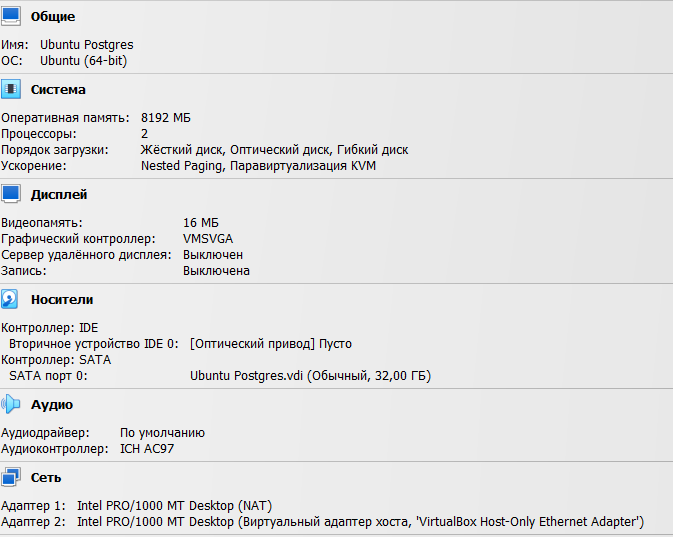

# Работа с уровнями изоляции транзакции в PostgreSQL

## Цель

научиться управлять уровнем изоляции транзации в PostgreSQL и понимать особенность работы уровней read commited и repeatable read

## Вывор конфигурации

Для установки и выполнения первого ДЗ, выбираем установку на локальной ВМ через OracleVM Virtualbox.
ВМ имеет следующую конфигурацию



Далее установил Ubuntu 24.04 (серверный) 

```sh
aduron@ubt-pg-aduron:~$ uname -a
Linux ubt-pg-aduron 6.8.0-85-generic #85-Ubuntu SMP PREEMPT_DYNAMIC Thu Sep 18 15:26:59 UTC 2025 x86_64 x86_64 x86_64 GNU/Linux
```

Сетевая конфигурация организована следующим образом

```sh
aduron@ubt-pg-aduron:~$ sudo cat /etc/netplan/01-netcfg.yaml
network:
  version: 2
  ethernets:
    enp0s3:
      dhcp4: yes
    enp0s8:
      dhcp4: no
      addresses: [192.168.56.10/24]
```

... что позволить после перезапуска networking, подключится в ssh с помощью виртуалного адаптера хоста (enp0s8)
```sh
aduron@ubt-pg-aduron:~$ ip add
1: lo: <LOOPBACK,UP,LOWER_UP> mtu 65536 qdisc noqueue state UNKNOWN group default qlen 1000
    link/loopback 00:00:00:00:00:00 brd 00:00:00:00:00:00
    inet 127.0.0.1/8 scope host lo
       valid_lft forever preferred_lft forever
    inet6 ::1/128 scope host noprefixroute
       valid_lft forever preferred_lft forever
2: enp0s3: <BROADCAST,MULTICAST,UP,LOWER_UP> mtu 1500 qdisc fq_codel state UP group default qlen 1000
    link/ether 08:00:27:05:2d:38 brd ff:ff:ff:ff:ff:ff
    inet 10.0.2.15/24 metric 100 brd 10.0.2.255 scope global dynamic enp0s3
       valid_lft 81909sec preferred_lft 81909sec
    inet6 fe80::a00:27ff:fe05:2d38/64 scope link
       valid_lft forever preferred_lft forever
3: enp0s8: <BROADCAST,MULTICAST,UP,LOWER_UP> mtu 1500 qdisc fq_codel state UP group default qlen 1000
    link/ether 08:00:27:21:d7:98 brd ff:ff:ff:ff:ff:ff
    inet 192.168.56.10/24 brd 192.168.56.255 scope global enp0s8
       valid_lft forever preferred_lft forever
    inet6 fe80::a00:27ff:fe21:d798/64 scope link
       valid_lft forever preferred_lft forever
```
Дальше установим нашу ssh ключ, который был сгенерирован на винде с PuTTYKeygen

### Установка Постгресса 

После подключения начнём с обновлением системы
```sh
sudo apt update && sudo apt upgrade
```

> [!NOTE]  
> Общая форма команды для установки репозитори, однако существуют и другие [в зависимости от вашей системы](https://tutorialforlinux.com/2020/10/14/how-to-add-postgresql-apt-repository-for-ubuntu-based-oses/)

```sh
sudo sh -c 'echo "deb http://apt.postgresql.org/pub/repos/apt $(lsb_release -cs)-pgdg main" > /etc/apt/sources.list.d/pgdg.list'
```

Дальше обновим список пакетов.
```sh
aduron@ubt-pg-aduron:~$ curl -fsSL https://www.postgresql.org/media/keys/ACCC4CF8.asc | sudo gpg --dearmor -o /etc/apt/trusted.gpg.d/postgresql.gpg
[sudo] password for aduron:
aduron@ubt-pg-aduron:~$ sudo apt update
Hit:1 http://security.ubuntu.com/ubuntu noble-security InRelease
Hit:2 http://archive.ubuntu.com/ubuntu noble InRelease
Hit:3 http://archive.ubuntu.com/ubuntu noble-updates InRelease
Hit:4 http://archive.ubuntu.com/ubuntu noble-backports InRelease
Get:5 http://apt.postgresql.org/pub/repos/apt noble-pgdg InRelease [107 kB]
Get:6 http://apt.postgresql.org/pub/repos/apt noble-pgdg/main amd64 Packages [349 kB]
Fetched 456 kB in 1s (399 kB/s)
Reading package lists... Done
Building dependency tree... Done
Reading state information... Done
All packages are up to date.
```

> [!TIP]
> Curl может и завершиться с ошибками устарения сертификата. В таком случае сертификат приходится обновлять следующим образом:

```sh
aduron@ubt-pg-aduron:~$ sudo apt upgrade ca-certificates
```


> [!NOTE]  
> Здесь установим именно в.17 постгресса, однако можно было бы запустить команду без суффикса, что позволяет установить последнюю версию. Или выбрать любую другую, например postgresql-15.

```sh
aduron@ubt-pg-aduron:~$ sudo apt install postgresql-17
Reading package lists... Done
Building dependency tree... Done
Reading state information... Done
The following additional packages will be installed:
  libcommon-sense-perl libjson-perl libjson-xs-perl libllvm19 libpq5 libtypes-serialiser-perl postgresql-client-17 postgresql-client-common postgresql-common ssl-cert
Suggested packages:
  libpq-oauth postgresql-doc-17
The following NEW packages will be installed:
  libcommon-sense-perl libjson-perl libjson-xs-perl libllvm19 libpq5 libtypes-serialiser-perl postgresql-17 postgresql-client-17 postgresql-client-common postgresql-common ssl-cert
0 upgraded, 11 newly installed, 0 to remove and 0 not upgraded.
Need to get 48.2 MB of archives.
After this operation, 200 MB of additional disk space will be used.
Do you want to continue? [Y/n] y

[...]
The files belonging to this database system will be owned by user "postgres".
This user must also own the server process.

The database cluster will be initialized with locale "en_US.UTF-8".
The default database encoding has accordingly been set to "UTF8".
The default text search configuration will be set to "english".

[...]

```
В просессе установки тоже отметим что кодировка является дефольтным UTF-8, и что процессы принадлежат УЗ postgres, которая была создана.

Проверим версию
```sh
aduron@ubt-pg-aduron:~$ psql --version
psql (PostgreSQL) 17.6 (Ubuntu 17.6-2.pgdg24.04+1)
```

Дальше активируем службу для будущих автоматическаих запусков, потому-что мы ленивы:
```sh
aduron@ubt-pg-aduron:~$ sudo systemctl enable postgresql
[sudo] password for aduron:
Synchronizing state of postgresql.service with SysV service script with /usr/lib/systemd/systemd-sysv-install.
Executing: /usr/lib/systemd/systemd-sysv-install enable postgresql

aduron@ubt-pg-aduron:~$ sudo systemctl status postgresql
● postgresql.service - PostgreSQL RDBMS
     Loaded: loaded (/usr/lib/systemd/system/postgresql.service; enabled; preset: enabled)
     Active: active (exited) since Fri 2025-10-10 18:49:42 UTC; 2h 34min ago
   Main PID: 2607 (code=exited, status=0/SUCCESS)
        CPU: 1ms

Oct 10 18:49:42 ubt-pg-aduron systemd[1]: Starting postgresql.service - PostgreSQL RDBMS...
Oct 10 18:49:42 ubt-pg-aduron systemd[1]: Finished postgresql.service - PostgreSQL RDBMS.
```

### Запуск сеансов 


```sh
aduron@ubt-pg-aduron:~$ sudo -u postgres psql
```

```sh
postgres=# \echo AUTOCOMMIT
AUTOCOMMIT
postgres=# \echo :AUTOCOMMIT
OFF
```

> [!IMPORTANT]  
> AUTOCOMMIT
> When on (the default), each SQL command is automatically committed upon successful completion. To postpone commit in this mode, you must enter a BEGIN or START TRANSACTION SQL command. When off or unset, SQL commands are not committed until you explicitly issue COMMIT or END. The autocommit-off mode works by issuing an implicit BEGIN for you, just before any command that is not already in a transaction block and is not itself a BEGIN or other transaction-control command, nor a command that cannot be executed inside a transaction block (such as VACUUM).


```sh
postgres=# \set PROMPT1 '(%n@SESSION1)> '
(postgres@SESSION1)>
```

```sh
postgres=# \set PROMPT1 '(%n@SESSION2)> '
(postgres@SESSION2)>
```

> [!CAUTION]
> Negative potential consequences of an action.


```sql
(postgres@SESSION1)> create table persons(id serial, first_name text, second_name text);
insert into persons(first_name, second_name) values('ivan', 'ivanov');
insert into persons(first_name, second_name) values('petr', 'petrov');
commit;

CREATE TABLE
INSERT 0 1
INSERT 0 1
COMMIT
(postgres@SESSION1)>
```


## Обзор уровня изоляции транзакции

> [!WARNING]  
> Critical content demanding immediate user attention due to potential risks.


```sql
(postgres@SESSION1)> \show transaction isolation level	<<<< Не то!
invalid command \show
Try \? for help.
(postgres@SESSION1)> SHOW TRANSACTION ISOLATION LEVEL;	<<<< Видимо больше ничего не работает до того как сделаем rollback
ERROR:  current transaction is aborted, commands ignored until end of transaction block
(postgres@SESSION1)>
(postgres@SESSION1)> ^C           						<<<< Почему бы и нет)
(postgres@SESSION1)>
(postgres@SESSION1)> abort;								<<<< Ура!
ROLLBACK
(postgres@SESSION1)> SHOW TRANSACTION ISOLATION LEVEL;	<<<< Правильно
 transaction_isolation
-----------------------
 read committed
(1 row)
```


```sql
(postgres@SESSION1)> select count(*) from persons;
 count
-------
     2
(1 row)
```
```sql
(postgres@SESSION2)>select count(*) from persons;
 count
-------
     2
(1 row)
```


```sql
(postgres@SESSION1)> insert into persons(first_name, second_name) values('sergey', 'sergeev');
INSERT 0 1
```
```sql
(postgres@SESSION2)>select * from persons;
 id | first_name | second_name
----+------------+-------------
  1 | ivan       | ivanov
  2 | petr       | petrov
(2 rows)
```
```sql
(postgres@SESSION1)> commit;
COMMIT
```
```sql
(postgres@SESSION2)>select * from persons;
 id | first_name | second_name
----+------------+-------------
  1 | ivan       | ivanov
  2 | petr       | petrov
  3 | sergey     | sergeev
(3 rows)
```


```sql
(postgres@SESSION1)> set transaction isolation level repeatable read;
SET
(postgres@SESSION1)> SHOW TRANSACTION ISOLATION LEVEL;
 transaction_isolation
-----------------------
 repeatable read
(1 row)
```
```sql
(postgres@SESSION2)>select * from persons;
 id | first_name | second_name
----+------------+-------------
  1 | ivan       | ivanov
  2 | petr       | petrov
  3 | sergey     | sergeev
(3 rows)
```
```sql
(postgres@SESSION1)> insert into persons(first_name, second_name) values('sveta', 'svetova');
INSERT 0 1
(postgres@SESSION1)>select * from persons;
 id | first_name | second_name
----+------------+-------------
  1 | ivan       | ivanov
  2 | petr       | petrov
  3 | sergey     | sergeev
  4 | sveta      | svetova
(4 rows)
```
```sql
(postgres@SESSION2)>select * from persons;
 id | first_name | second_name
----+------------+-------------
  1 | ivan       | ivanov
  2 | petr       | petrov
  3 | sergey     | sergeev
(3 rows)
```


```sql
(postgres@SESSION1)> commit;
COMMIT
```

```sql
(postgres@SESSION2)> select * from persons;
 id | first_name | second_name
----+------------+-------------
  1 | ivan       | ivanov
  2 | petr       | petrov
  3 | sergey     | sergeev
(3 rows)
```


## Список использованных источников:

1. [Установка постгресса на Ubuntu](https://dev.to/johndotowl/postgresql-17-installation-on-ubuntu-2404-5bfi?ysclid=mgjmgn34tt98683277)
2. [Markdown Cheat Sheet](https://www.markdownguide.org/cheat-sheet/)
3. [Postgres Documentation](https://www.postgresql.org/docs/current/app-psql.html)

