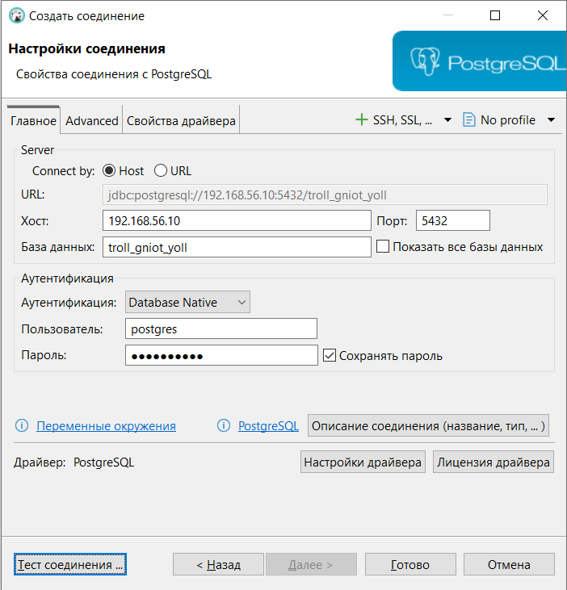
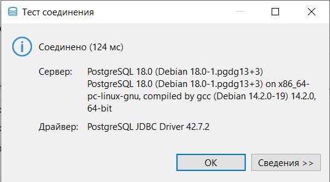
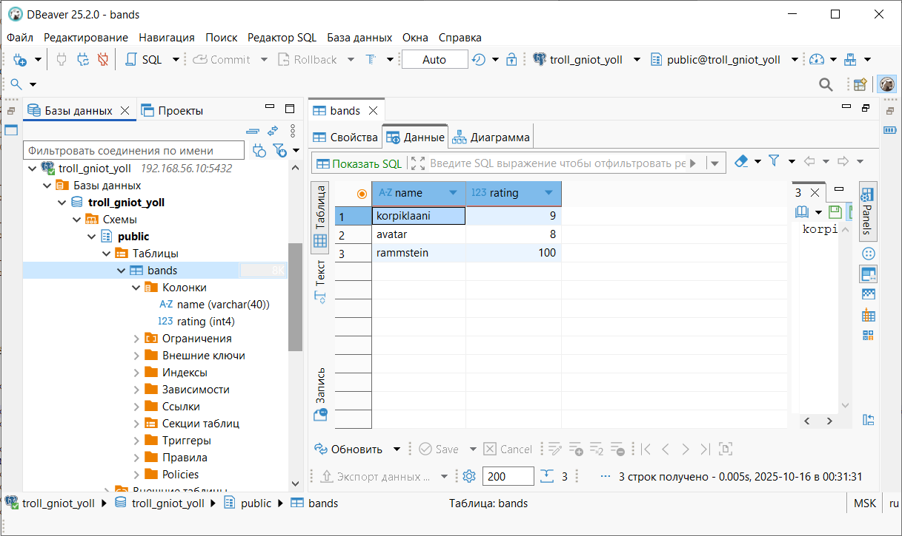

# Установка и настройка PostgteSQL в контейнере Docker

## Цель

- установить PostgreSQL в Docker контейнере
- настроить контейнер для внешнего подключения

## План

1. создать ВМ с Ubuntu 20.04/22.04 или развернуть докер любым удобным способом
2. поставить на нем Docker Engine
3. сделать каталог /var/lib/postgres
4. развернуть контейнер с PostgreSQL 15 смонтировав в него /var/lib/postgresql
5. развернуть контейнер с клиентом postgres
6. подключится из контейнера с клиентом к контейнеру с сервером и сделать таблицу с парой строк
7. подключится к контейнеру с сервером с ноутбука/компьютера извне инстансов ЯО/места установки докера
8. удалить контейнер с сервером
9. создать его заново
10. подключится снова из контейнера с клиентом к контейнеру с сервером
11. проверить, что данные остались на месте
12. оставляйте в ЛК ДЗ комментарии что и как вы делали и как боролись с проблемами


## Выполнение


### 1. создать ВМ с Ubuntu 20.04/22.04 или развернуть докер любым удобным способом

Мы повторно используем нашу ВМ, создана в рамках предыдущего ДЗ


### 2. поставить на нем Docker Engine

Устанавливаем необходимые для докера зависимости 

```sh
aduron@ubt-pg-aduron:~$ sudo apt install -y \
    apt-transport-https \
    ca-certificates \
    curl \
    gnupg \
    lsb-release \
    software-properties-common \
    wget \
    unzip
[sudo] password for aduron:
Reading package lists... Done
Building dependency tree... Done
Reading state information... Done
ca-certificates is already the newest version (20240203).
curl is already the newest version (8.5.0-2ubuntu10.6).
curl set to manually installed.
gnupg is already the newest version (2.4.4-2ubuntu17.3).
gnupg set to manually installed.
lsb-release is already the newest version (12.0-2).
lsb-release set to manually installed.
software-properties-common is already the newest version (0.99.49.3).
software-properties-common set to manually installed.
wget is already the newest version (1.21.4-1ubuntu4.1).
wget set to manually installed.
Suggested packages:
  zip
The following NEW packages will be installed:
  apt-transport-https unzip
0 upgraded, 2 newly installed, 0 to remove and 0 not upgraded.
Need to get 178 kB of archives.
After this operation, 421 kB of additional disk space will be used.
Get:1 http://archive.ubuntu.com/ubuntu noble-updates/universe amd64 apt-transport-https all 2.8.3 [3,970 B]
Get:2 http://archive.ubuntu.com/ubuntu noble-updates/main amd64 unzip amd64 6.0-28ubuntu4.1 [174 kB]
Fetched 178 kB in 1s (249 kB/s)
Selecting previously unselected package apt-transport-https.
(Reading database ... 89428 files and directories currently installed.)
Preparing to unpack .../apt-transport-https_2.8.3_all.deb ...
Unpacking apt-transport-https (2.8.3) ...
Selecting previously unselected package unzip.
Preparing to unpack .../unzip_6.0-28ubuntu4.1_amd64.deb ...
Unpacking unzip (6.0-28ubuntu4.1) ...
Setting up apt-transport-https (2.8.3) ...
Setting up unzip (6.0-28ubuntu4.1) ...
Processing triggers for man-db (2.12.0-4build2) ...
Scanning processes...
Scanning linux images...

Running kernel seems to be up-to-date.

No services need to be restarted.

No containers need to be restarted.

No user sessions are running outdated binaries.

No VM guests are running outdated hypervisor (qemu) binaries on this host.
```

Скачиваем и добавляем официальный GPG ключ Docker

```sh
aduron@ubt-pg-aduron:~$ sudo  curl -fsSL https://download.docker.com/linux/ubuntu/gpg | sudo gpg --dearmor -o /usr/share/keyrings/docker-archive-keyring.gpg
File '/usr/share/keyrings/docker-archive-keyring.gpg' exists. Overwrite? (y/N) y
```

Добавляем официальный репозиторий Docker

```sh
aduron@ubt-pg-aduron:~$ echo \
  "deb [arch=$(dpkg --print-architecture) signed-by=/usr/share/keyrings/docker-archive-keyring.gpg] https://download.docker.com/linux/ubuntu \
  $(lsb_release -cs) stable" | sudo tee /etc/apt/sources.list.d/docker.list > /dev/null
aduron@ubt-pg-aduron:~$ cat /etc/apt/sources.list.d/docker.list
deb [arch=amd64 signed-by=/usr/share/keyrings/docker-archive-keyring.gpg] https://download.docker.com/linux/ubuntu   noble stable

aduron@ubt-pg-aduron:~$ sudo apt update
Get:1 https://download.docker.com/linux/ubuntu noble InRelease [48.5 kB]
Get:2 http://apt.postgresql.org/pub/repos/apt noble-pgdg InRelease [107 kB]
Hit:3 http://archive.ubuntu.com/ubuntu noble InRelease
Get:4 https://download.docker.com/linux/ubuntu noble/stable amd64 Packages [33.0 kB]
Get:5 http://security.ubuntu.com/ubuntu noble-security InRelease [126 kB]
Get:6 http://security.ubuntu.com/ubuntu noble-security/main amd64 Packages [1,217 kB]
Get:7 http://apt.postgresql.org/pub/repos/apt noble-pgdg/main amd64 Packages [350 kB]
Get:8 http://archive.ubuntu.com/ubuntu noble-updates InRelease [126 kB]
Get:9 http://archive.ubuntu.com/ubuntu noble-backports InRelease [126 kB]
Get:10 http://security.ubuntu.com/ubuntu noble-security/main Translation-en [202 kB]
Get:11 http://security.ubuntu.com/ubuntu noble-security/main amd64 Components [21.5 kB]
Get:12 http://security.ubuntu.com/ubuntu noble-security/main amd64 c-n-f Metadata [8,748 B]
Get:13 http://security.ubuntu.com/ubuntu noble-security/restricted amd64 Packages [1,978 kB]
Get:14 http://archive.ubuntu.com/ubuntu noble-updates/main amd64 Packages [1,498 kB]
Get:15 http://security.ubuntu.com/ubuntu noble-security/restricted Translation-en [450 kB]
Get:16 http://security.ubuntu.com/ubuntu noble-security/restricted amd64 Components [208 B]
Get:17 http://security.ubuntu.com/ubuntu noble-security/universe amd64 Packages [884 kB]
Get:18 http://security.ubuntu.com/ubuntu noble-security/universe Translation-en [196 kB]
Get:19 http://security.ubuntu.com/ubuntu noble-security/universe amd64 Components [52.3 kB]
Get:20 http://security.ubuntu.com/ubuntu noble-security/universe amd64 c-n-f Metadata [18.1 kB]
Get:21 http://security.ubuntu.com/ubuntu noble-security/multiverse amd64 Components [212 B]
Get:22 http://archive.ubuntu.com/ubuntu noble-updates/main Translation-en [288 kB]
Get:23 http://archive.ubuntu.com/ubuntu noble-updates/main amd64 Components [175 kB]
Get:24 http://archive.ubuntu.com/ubuntu noble-updates/main amd64 c-n-f Metadata [15.3 kB]
Get:25 http://archive.ubuntu.com/ubuntu noble-updates/restricted amd64 Packages [2,084 kB]
Get:26 http://archive.ubuntu.com/ubuntu noble-updates/restricted Translation-en [471 kB]
Get:27 http://archive.ubuntu.com/ubuntu noble-updates/restricted amd64 Components [212 B]
Get:28 http://archive.ubuntu.com/ubuntu noble-updates/universe amd64 Packages [1,489 kB]
Get:29 http://archive.ubuntu.com/ubuntu noble-updates/universe Translation-en [301 kB]
Get:30 http://archive.ubuntu.com/ubuntu noble-updates/universe amd64 Components [378 kB]
Get:31 http://archive.ubuntu.com/ubuntu noble-updates/universe amd64 c-n-f Metadata [31.2 kB]
Get:32 http://archive.ubuntu.com/ubuntu noble-updates/multiverse amd64 Components [940 B]
Get:33 http://archive.ubuntu.com/ubuntu noble-backports/main amd64 Components [7,156 B]
Get:34 http://archive.ubuntu.com/ubuntu noble-backports/restricted amd64 Components [216 B]
Get:35 http://archive.ubuntu.com/ubuntu noble-backports/universe amd64 Components [11.0 kB]
Get:36 http://archive.ubuntu.com/ubuntu noble-backports/multiverse amd64 Components [212 B]
Fetched 12.7 MB in 3s (4,989 kB/s)
Reading package lists... Done
Building dependency tree... Done
Reading state information... Done
1 package can be upgraded. Run 'apt list --upgradable' to see it.
```

Устанавливаем Docker Engine

```sh
aduron@ubt-pg-aduron:~$ sudo apt install -y docker-ce docker-ce-cli containerd.io docker-buildx-plugin docker-compose-plugin
Reading package lists... Done
Building dependency tree... Done
Reading state information... Done
The following additional packages will be installed:
  docker-ce-rootless-extras libslirp0 pigz slirp4netns
Suggested packages:
  cgroupfs-mount | cgroup-lite docker-model-plugin
The following NEW packages will be installed:
  containerd.io docker-buildx-plugin docker-ce docker-ce-cli docker-ce-rootless-extras docker-compose-plugin
  libslirp0 pigz slirp4netns
0 upgraded, 9 newly installed, 0 to remove and 1 not upgraded.
Need to get 105 MB of archives.
After this operation, 436 MB of additional disk space will be used.
Get:1 https://download.docker.com/linux/ubuntu noble/stable amd64 containerd.io amd64 1.7.28-1~ubuntu.24.04~noble [31.9 MB]
Get:2 http://archive.ubuntu.com/ubuntu noble/universe amd64 pigz amd64 2.8-1 [65.6 kB]
Get:3 http://archive.ubuntu.com/ubuntu noble/main amd64 libslirp0 amd64 4.7.0-1ubuntu3 [63.8 kB]
Get:4 http://archive.ubuntu.com/ubuntu noble/universe amd64 slirp4netns amd64 1.2.1-1build2 [34.9 kB]
Get:5 https://download.docker.com/linux/ubuntu noble/stable amd64 docker-ce-cli amd64 5:28.5.1-1~ubuntu.24.04~noble [16.5 MB]
Get:6 https://download.docker.com/linux/ubuntu noble/stable amd64 docker-ce amd64 5:28.5.1-1~ubuntu.24.04~noble [19.7 MB]
Get:7 https://download.docker.com/linux/ubuntu noble/stable amd64 docker-buildx-plugin amd64 0.29.1-1~ubuntu.24.04~noble [15.9 MB]
Get:8 https://download.docker.com/linux/ubuntu noble/stable amd64 docker-ce-rootless-extras amd64 5:28.5.1-1~ubuntu.24.04~noble [6,481 kB]
Get:9 https://download.docker.com/linux/ubuntu noble/stable amd64 docker-compose-plugin amd64 2.40.0-1~ubuntu.24.04~noble [14.2 MB]
Fetched 105 MB in 5s (20.6 MB/s)
Selecting previously unselected package containerd.io.
(Reading database ... 89450 files and directories currently installed.)
Preparing to unpack .../0-containerd.io_1.7.28-1~ubuntu.24.04~noble_amd64.deb ...
Unpacking containerd.io (1.7.28-1~ubuntu.24.04~noble) ...
Selecting previously unselected package docker-ce-cli.
Preparing to unpack .../1-docker-ce-cli_5%3a28.5.1-1~ubuntu.24.04~noble_amd64.deb ...
Unpacking docker-ce-cli (5:28.5.1-1~ubuntu.24.04~noble) ...
Selecting previously unselected package docker-ce.
Preparing to unpack .../2-docker-ce_5%3a28.5.1-1~ubuntu.24.04~noble_amd64.deb ...
Unpacking docker-ce (5:28.5.1-1~ubuntu.24.04~noble) ...
Selecting previously unselected package pigz.
Preparing to unpack .../3-pigz_2.8-1_amd64.deb ...
Unpacking pigz (2.8-1) ...
Selecting previously unselected package docker-buildx-plugin.
Preparing to unpack .../4-docker-buildx-plugin_0.29.1-1~ubuntu.24.04~noble_amd64.deb ...
Unpacking docker-buildx-plugin (0.29.1-1~ubuntu.24.04~noble) ...
Selecting previously unselected package docker-ce-rootless-extras.
Preparing to unpack .../5-docker-ce-rootless-extras_5%3a28.5.1-1~ubuntu.24.04~noble_amd64.deb ...
Unpacking docker-ce-rootless-extras (5:28.5.1-1~ubuntu.24.04~noble) ...
Selecting previously unselected package docker-compose-plugin.
Preparing to unpack .../6-docker-compose-plugin_2.40.0-1~ubuntu.24.04~noble_amd64.deb ...
Unpacking docker-compose-plugin (2.40.0-1~ubuntu.24.04~noble) ...
Selecting previously unselected package libslirp0:amd64.
Preparing to unpack .../7-libslirp0_4.7.0-1ubuntu3_amd64.deb ...
Unpacking libslirp0:amd64 (4.7.0-1ubuntu3) ...
Selecting previously unselected package slirp4netns.
Preparing to unpack .../8-slirp4netns_1.2.1-1build2_amd64.deb ...
Unpacking slirp4netns (1.2.1-1build2) ...
Setting up docker-buildx-plugin (0.29.1-1~ubuntu.24.04~noble) ...
Setting up containerd.io (1.7.28-1~ubuntu.24.04~noble) ...
Created symlink /etc/systemd/system/multi-user.target.wants/containerd.service → /usr/lib/systemd/system/containerd.service.
Setting up docker-compose-plugin (2.40.0-1~ubuntu.24.04~noble) ...
Setting up docker-ce-cli (5:28.5.1-1~ubuntu.24.04~noble) ...
Setting up libslirp0:amd64 (4.7.0-1ubuntu3) ...
Setting up pigz (2.8-1) ...
Setting up docker-ce-rootless-extras (5:28.5.1-1~ubuntu.24.04~noble) ...
Setting up slirp4netns (1.2.1-1build2) ...
Setting up docker-ce (5:28.5.1-1~ubuntu.24.04~noble) ...
Created symlink /etc/systemd/system/multi-user.target.wants/docker.service → /usr/lib/systemd/system/docker.service.
Created symlink /etc/systemd/system/sockets.target.wants/docker.socket → /usr/lib/systemd/system/docker.socket.
Processing triggers for man-db (2.12.0-4build2) ...
Processing triggers for libc-bin (2.39-0ubuntu8.6) ...
Scanning processes...
Scanning linux images...

Running kernel seems to be up-to-date.

No services need to be restarted.

No containers need to be restarted.

No user sessions are running outdated binaries.

No VM guests are running outdated hypervisor (qemu) binaries on this host.
```

Проверка версии 
```sh
aduron@ubt-pg-aduron:~$ docker -v
Docker version 28.5.1, build e180ab8
```


### 3. сделать каталог /var/lib/postgres

В связи с тем, что у меня уже на ВМ находиться папка /var/lib/postgresql с предыдушего ДЗ, создам другую папку postgresql-docker.
Дальше увидим, что идея такая себе.
```sh
aduron@ubt-pg-aduron:~$ sudo mkdir -p /var/lib/postgresql-docker
aduron@ubt-pg-aduron:~$ sudo chmod -R 666 /var/lib/postgresql-docker
aduron@ubt-pg-aduron:~$ ls -lrt /var/lib |grep postgresql-docker
drw-rw-rw-  2 root      root      4096 Oct 15 18:39 postgresql-docker
```


### 4. развернуть контейнер с PostgreSQL смонтировав в него /var/lib/postgresql

Проверяем, какие у нас доступные образцы. Их нет, потому что мы до сих пор ничего не забирали 
```sh
aduron@ubt-pg-aduron:~$ sudo docker images
REPOSITORY   TAG       IMAGE ID   CREATED   SIZE
aduron@ubt-pg-aduron:~$ sudo docker search postgres
Error response from daemon: Get "https://index.docker.io/v1/search?q=postgres&n=25": tls: failed to verify certificate: x509: certificate signed by unknown authority
```

> [!TIP]
> команда может и завершиться с ошибками проверки сертификата. В таком случае сертификат приходится обновлять следующим образом:

```sh
aduron@ubt-pg-aduron:~$ sudo apt upgrade ca-certificates
aduron@ubt-pg-aduron:~$ sudo systemctl restart docker
```

Снова запускаем пойск
```sh
aduron@ubt-pg-aduron:~$ sudo docker search postgres
NAME                       DESCRIPTION                                     STARS     OFFICIAL
postgres                   The PostgreSQL object-relational database sy…   14590     [OK]
circleci/postgres          The PostgreSQL object-relational database sy…   34
cimg/postgres                                                              4
elestio/postgres           Postgres, verified and packaged by Elestio      1
kasmweb/postgres           Postgres image maintained by Kasm Technologi…   5
ubuntu/postgres            PostgreSQL is an open source object-relation…   41
mcp/postgres               Connect with read-only access to PostgreSQL …   29
chainguard/postgres        Build, ship and run secure software with Cha…   1
artifacthub/postgres                                                       0
corpusops/postgres         https://github.com/corpusops/docker-images/     0
geokrety/postgres          Postgres with postgis + quantile and amqp ex…   0
cleanstart/postgres        Secure by Design, Built for Speed, Hardened …   0
rootpublic/postgres                                                        0
dockette/postgres          My PostgreSQL image with tunning and preinst…   1
vulhub/postgres                                                            0
wayofdev/postgres                                                          0
pgrouting/postgres          Postgres Docker images with PostGIS and dep…   0
uselagoon/postgres                                                         0
openeuler/postgres                                                         0
clarinpl/postgres                                                          0
supabase/postgres          Unmodified Postgres with some useful plugins…   66
trainlineeurope/postgres   Extended version of official Postgres https:…   0
brimstone/postgres         postgres image with traefik-cert support        0
blacklabelops/postgres     Postgres Image for Atlassian Applications       4
fredboat/postgres          PostgreSQL 10.0 used in FredBoat's docker-co…   1
```

И дальше забираем тот самый первый образец
```sh
aduron@ubt-pg-aduron:~$ sudo docker pull postgres
Using default tag: latest
latest: Pulling from library/postgres
8c7716127147: Pull complete
1014e14b3351: Pull complete
edd90ab5059f: Pull complete
f0d70120d9e2: Pull complete
dd6d7b9d8ba8: Pull complete
203b16f56a7d: Pull complete
751039babae5: Pull complete
f5af7533693a: Pull complete
9a68d6020eab: Pull complete
f69a7c424b50: Pull complete
eed0ac863490: Pull complete
2433c366ca00: Pull complete
a585c5f82f15: Pull complete
af60ce4418c9: Pull complete
Digest: sha256:073e7c8b84e2197f94c8083634640ab37105effe1bc853ca4d5fbece3219b0e8
Status: Downloaded newer image for postgres:latest
docker.io/library/postgres:latest

aduron@ubt-pg-aduron:~$ sudo docker image ls
REPOSITORY   TAG       IMAGE ID       CREATED       SIZE
postgres     latest    194f5f2a900a   2 weeks ago   456MB
```

> [!NOTE]  
> Здесь забрали самый свежый и официальный в.18 постгресса, однако можно было бы скачать другие варианты.


запускаем его, смонтировав нашу папку из хоста /var/lib/postgresql-docker/

```sh
aduron@ubt-pg-aduron:~$ sudo docker run --mount type=bind,source=/var/lib/postgresql,target=/var/lib/postgresql-docker postgres
Error: Database is uninitialized and superuser password is not specified.
       You must specify POSTGRES_PASSWORD to a non-empty value for the
       superuser. For example, "-e POSTGRES_PASSWORD=password" on "docker run".

       You may also use "POSTGRES_HOST_AUTH_METHOD=trust" to allow all
       connections without a password. This is *not* recommended.

       See PostgreSQL documentation about "trust":
       https://www.postgresql.org/docs/current/auth-trust.html
```

Наконец-то добавим всё что нужно, для успешного запуска 
```sh
aduron@ubt-pg-aduron:~$ sudo docker run --name ctn_database --mount type=bind,source=/var/lib/postgresql,target=/var/lib/postgresql-docker -e POSTGRES_PASSWORD=Oracle123! -d postgres
ebd65c850be3c6c7b252bf12e4c483bf481481fb4f719e3d5d951b6fe76598b2
```

С этой...
```sh
aduron@ubt-pg-aduron:~$ sudo docker ps
CONTAINER ID   IMAGE      COMMAND                  CREATED              STATUS              PORTS      NAMES
ebd65c850be3   postgres   "docker-entrypoint.s…"   About a minute ago   Up About a minute   5432/tcp   ctn_database

aduron@ubt-pg-aduron:~$ sudo docker exec -it ebd65c850be3 bash
root@ebd65c850be3:/#
```


```sh
root@ebd65c850be3:/# ls -lrt /var/lib/postgresql-docker/   <<<< перепутал source и target. Отлично!
total 4
drwxr-xr-x 3 110 112 4096 Oct 10 18:49 17
root@ebd65c850be3:/# ls -lrt /var/lib/postgresql/   	<<<< создал другую папку, при это узнали что у нас V18 в докере. 
total 4
lrwxrwxrwx 1 root root    1 Sep 30 00:06 data -> .
drwxr-xr-x 3 root root 4096 Oct 15 19:11 18
```


```sh
aduron@ubt-pg-aduron:~$ sudo docker stop  ebd65c850be3
ebd65c850be3
aduron@ubt-pg-aduron:~$ sudo docker ps
CONTAINER ID   IMAGE     COMMAND   CREATED   STATUS    PORTS     NAMES
aduron@ubt-pg-aduron:~$ sudo rm -rf /var/lib/postgresql-docker/
```

```sh
aduron@ubt-pg-aduron:~$ sudo chmod 777 /var/lib/postgresql/
aduron@ubt-pg-aduron:~$ ls -lrt /var/lib/ |grep postgresql
drwxrwxrwx  3 postgres  postgres  4096 Oct 10 20:11 postgresql

aduron@ubt-pg-aduron:~$ sudo docker run --name ctn_database --mount type=bind,source=/var/lib/postgresql,target=/var/lib/postgresql -e POSTGRES_PASSWORD=Oracle123! -d postgres
docker: Error response from daemon: Conflict. The container name "/ctn_database" is already in use by container "ebd65c850be3c6c7b252bf12e4c483bf481481fb4f719e3d5d951b6fe76598b2". You have to remove (or rename) that container to be able to reuse that name.

Run 'docker run --help' for more information
aduron@ubt-pg-aduron:~$ sudo docker ps -a
CONTAINER ID   IMAGE      COMMAND                  CREATED          STATUS                      PORTS     NAMES
ebd65c850be3   postgres   "docker-entrypoint.s…"   14 minutes ago   Exited (0) 7 minutes ago              ctn_database
6cf30870893e   postgres   "docker-entrypoint.s…"   16 minutes ago   Exited (1) 16 minutes ago             optimistic_benz
48c15630249d   postgres   "docker-entrypoint.s…"   17 minutes ago   Exited (1) 17 minutes ago             unruffled_gates
45df84ac0a70   postgres   "docker-entrypoint.s…"   23 minutes ago   Exited (1) 23 minutes ago             elated_kare
```

```sh
aduron@ubt-pg-aduron:~$ sudo docker rm ctn_database
ctn_database
aduron@ubt-pg-aduron:~$ sudo docker ps -a
CONTAINER ID   IMAGE      COMMAND                  CREATED          STATUS                      PORTS     NAMES
6cf30870893e   postgres   "docker-entrypoint.s…"   17 minutes ago   Exited (1) 17 minutes ago             optimistic_benz
48c15630249d   postgres   "docker-entrypoint.s…"   18 minutes ago   Exited (1) 18 minutes ago             unruffled_gates
45df84ac0a70   postgres   "docker-entrypoint.s…"   24 minutes ago   Exited (1) 24 minutes ago             elated_kare
```

```sh
aduron@ubt-pg-aduron:~$ sudo docker run --name ctn_database --mount type=bind,source=/var/lib/postgresql,target=/var/lib/postgresql -e POSTGRES_PASSWORD=Oracle123! -d postgres
1907d67b65be8a5ff9bc5f84b6744309c03a285a946f8f8623bfdef5538e73be
aduron@ubt-pg-aduron:~$ sudo docker ps -a
CONTAINER ID   IMAGE      COMMAND                  CREATED          STATUS                      PORTS      NAMES
1907d67b65be   postgres   "docker-entrypoint.s…"   5 seconds ago    Up 4 seconds                5432/tcp   ctn_database
6cf30870893e   postgres   "docker-entrypoint.s…"   17 minutes ago   Exited (1) 17 minutes ago              optimistic_benz
48c15630249d   postgres   "docker-entrypoint.s…"   19 minutes ago   Exited (1) 18 minutes ago              unruffled_gates
45df84ac0a70   postgres   "docker-entrypoint.s…"   24 minutes ago   Exited (1) 24 minutes ago              elated_kare
```


```sh
aduron@ubt-pg-aduron:~$ sudo docker exec -it 1907d67b65be bash
```

```sql
root@1907d67b65be:/# psql -U postgres
psql (18.0 (Debian 18.0-1.pgdg13+3))
Type "help" for help.

postgres=# \l
                                                    List of databases
   Name    |  Owner   | Encoding | Locale Provider |  Collate   |   Ctype    | Locale | ICU Rules |   Access privileges
-----------+----------+----------+-----------------+------------+------------+--------+-----------+-----------------------
 postgres  | postgres | UTF8     | libc            | en_US.utf8 | en_US.utf8 |        |           |
 template0 | postgres | UTF8     | libc            | en_US.utf8 | en_US.utf8 |        |           | =c/postgres          +
           |          |          |                 |            |            |        |           | postgres=CTc/postgres
 template1 | postgres | UTF8     | libc            | en_US.utf8 | en_US.utf8 |        |           | =c/postgres          +
           |          |          |                 |            |            |        |           | postgres=CTc/postgres
(3 rows)
```


```sql
postgres=# create database troll_gniot_yoll;
CREATE DATABASE
postgres=# \l

       Name       |  Owner   | Encoding | Locale Provider |  Collate   |   Ctype    | Locale | ICU Rules |   Access privileges
------------------+----------+----------+-----------------+------------+------------+--------+-----------+-----------------------
 postgres         | postgres | UTF8     | libc            | en_US.utf8 | en_US.utf8 |        |           |
 template0        | postgres | UTF8     | libc            | en_US.utf8 | en_US.utf8 |        |           | =c/postgres          +
                  |          |          |                 |            |            |        |           | postgres=CTc/postgres
 template1        | postgres | UTF8     | libc            | en_US.utf8 | en_US.utf8 |        |           | =c/postgres          +
                  |          |          |                 |            |            |        |           | postgres=CTc/postgres
 troll_gniot_yoll | postgres | UTF8     | libc            | en_US.utf8 | en_US.utf8 |        |           |
(4 rows)
```


```sh
aduron@ubt-pg-aduron:~$ ifconfig -a
docker0: flags=4163<UP,BROADCAST,RUNNING,MULTICAST>  mtu 1500
        inet 172.17.0.1  netmask 255.255.0.0  broadcast 172.17.255.255
        inet6 fe80::acaa:92ff:fe17:8fbb  prefixlen 64  scopeid 0x20<link>
        ether ae:aa:92:17:8f:bb  txqueuelen 0  (Ethernet)
        RX packets 9  bytes 252 (252.0 B)
        RX errors 0  dropped 0  overruns 0  frame 0
        TX packets 11  bytes 1186 (1.1 KB)
        TX errors 0  dropped 0 overruns 0  carrier 0  collisions 0

enp0s3: flags=4163<UP,BROADCAST,RUNNING,MULTICAST>  mtu 1500
        inet 10.0.2.15  netmask 255.255.255.0  broadcast 10.0.2.255
        inet6 fe80::a00:27ff:fe05:2d38  prefixlen 64  scopeid 0x20<link>
        ether 08:00:27:05:2d:38  txqueuelen 1000  (Ethernet)
        RX packets 112462  bytes 168795235 (168.7 MB)
        RX errors 0  dropped 0  overruns 0  frame 0
        TX packets 11083  bytes 818452 (818.4 KB)
        TX errors 0  dropped 0 overruns 0  carrier 0  collisions 0

enp0s8: flags=4163<UP,BROADCAST,RUNNING,MULTICAST>  mtu 1500
        inet 192.168.56.10  netmask 255.255.255.0  broadcast 192.168.56.255
        inet6 fe80::a00:27ff:fe21:d798  prefixlen 64  scopeid 0x20<link>
        ether 08:00:27:21:d7:98  txqueuelen 1000  (Ethernet)
        RX packets 3032  bytes 284452 (284.4 KB)
        RX errors 0  dropped 0  overruns 0  frame 0
        TX packets 1623  bytes 244338 (244.3 KB)
        TX errors 0  dropped 0 overruns 0  carrier 0  collisions 0

lo: flags=73<UP,LOOPBACK,RUNNING>  mtu 65536
        inet 127.0.0.1  netmask 255.0.0.0
        inet6 ::1  prefixlen 128  scopeid 0x10<host>
        loop  txqueuelen 1000  (Local Loopback)
        RX packets 246  bytes 31078 (31.0 KB)
        RX errors 0  dropped 0  overruns 0  frame 0
        TX packets 246  bytes 31078 (31.0 KB)
        TX errors 0  dropped 0 overruns 0  carrier 0  collisions 0

vetha8866b4: flags=4163<UP,BROADCAST,RUNNING,MULTICAST>  mtu 1500
        inet6 fe80::94fc:b0ff:fe43:54ac  prefixlen 64  scopeid 0x20<link>
        ether 96:fc:b0:43:54:ac  txqueuelen 0  (Ethernet)
        RX packets 3  bytes 126 (126.0 B)
        RX errors 0  dropped 0  overruns 0  frame 0
        TX packets 15  bytes 1226 (1.2 KB)
        TX errors 0  dropped 0 overruns 0  carrier 0  collisions 0

aduron@ubt-pg-aduron:~$ psql -h 192.168.56.10 -p 5432 -U postgres
psql: error: connection to server at "192.168.56.10", port 5432 failed: Connection refused
        Is the server running on that host and accepting TCP/IP connections?
aduron@ubt-pg-aduron:~$ psql -h 10.0.2.15 -p 5432 -U postgres
psql: error: connection to server at "10.0.2.15", port 5432 failed: Connection refused
        Is the server running on that host and accepting TCP/IP connections?
aduron@ubt-pg-aduron:~$ psql -h 172.17.0.1 -p 5432 -U postgres
psql: error: connection to server at "172.17.0.1", port 5432 failed: Connection refused
        Is the server running on that host and accepting TCP/IP connections?
```

Тут очевидно что нужно сделать какую-то переадресацию порта, чтобы наша база стала видной извне контайнера 
После очень краткой борьбы с этим вопросом, нашел такое [решение](https://stackoverflow.com/questions/37694987/connecting-to-postgresql-in-a-docker-container-from-outside)


```sh
aduron@ubt-pg-aduron:~$ sudo docker rm ctn_database
ctn_database
aduron@ubt-pg-aduron:~$ sudo docker run --name ctn_database --mount type=bind,source=/var/lib/postgresql,target=/var/lib/postgresql -e POSTGRES_PASSWORD=Oracle123! -d -p 5432:5432 postgres
c071098e2815b517536b897f64927d4e194b950f7c8865e36ead24c2c2c7dda6

aduron@ubt-pg-aduron:~$ sudo docker ps -a
CONTAINER ID   IMAGE      COMMAND                  CREATED          STATUS                      PORTS                                         NAMES
c071098e2815   postgres   "docker-entrypoint.s…"   17 seconds ago   Up 17 seconds               0.0.0.0:5432->5432/tcp, [::]:5432->5432/tcp   ctn_database
6cf30870893e   postgres   "docker-entrypoint.s…"   36 minutes ago   Exited (1) 36 minutes ago                                                 optimistic_benz
48c15630249d   postgres   "docker-entrypoint.s…"   37 minutes ago   Exited (1) 37 minutes ago                                                 unruffled_gates
45df84ac0a70   postgres   "docker-entrypoint.s…"   43 minutes ago   Exited (1) 43 minutes ago                                                 elated_kare
```


```sql
aduron@ubt-pg-aduron:~$ psql -h 192.168.56.10 -p 5432 -U postgres
Password for user postgres:
psql (17.6 (Ubuntu 17.6-2.pgdg24.04+1), server 18.0 (Debian 18.0-1.pgdg13+3))
WARNING: psql major version 17, server major version 18.
         Some psql features might not work.
Type "help" for help.

postgres=# \l
                                                        List of databases
       Name       |  Owner   | Encoding | Locale Provider |  Collate   |   Ctype    | Locale | ICU Rules |   Access privileges
------------------+----------+----------+-----------------+------------+------------+--------+-----------+-----------------------
 postgres         | postgres | UTF8     | libc            | en_US.utf8 | en_US.utf8 |        |           |
 template0        | postgres | UTF8     | libc            | en_US.utf8 | en_US.utf8 |        |           | =c/postgres          +
                  |          |          |                 |            |            |        |           | postgres=CTc/postgres
 template1        | postgres | UTF8     | libc            | en_US.utf8 | en_US.utf8 |        |           | =c/postgres          +
                  |          |          |                 |            |            |        |           | postgres=CTc/postgres
 troll_gniot_yoll | postgres | UTF8     | libc            | en_US.utf8 | en_US.utf8 |        |           |
(4 rows)

postgres=#
```


### 5. развернуть контейнер с клиентом postgres


```sh
aduron@ubt-pg-aduron:~$ cd pgclient/
aduron@ubt-pg-aduron:~/pgclient$ cat Dockerfile
FROM ubuntu:latest
# install app dependencies
RUN apt-get update && apt-get install -y postgresql-client
```

```sh
aduron@ubt-pg-aduron:~/pgclient$ sudo docker build -t pgclient .
[+] Building 1.7s (6/6) FINISHED                                                    docker:default
 => [internal] load build definition from Dockerfile                                          0.0s
 => => transferring dockerfile: 142B                                                          0.0s
 => [internal] load metadata for docker.io/library/ubuntu:latest                              1.5s
 => [internal] load .dockerignore                                                             0.0s
 => => transferring context: 2B                                                               0.0s
 => [1/2] FROM docker.io/library/ubuntu:latest@sha256:66460d557b25769b102175144d538d88219c07  0.0s
 => CACHED [2/2] RUN apt-get update && apt-get install -y postgresql-client                   0.0s
 => exporting to image                                                                        0.0s
 => => exporting layers                                                                       0.0s
 => => writing image sha256:529d3b45d71067ed6b74a525e61d71e15fb32ebe7c0bfbcdf280f888a96ce78e  0.0s
 => => naming to docker.io/library/pgclient   
```


```sh
aduron@ubt-pg-aduron:~$ docker run pgclient
```

```sh
aduron@ubt-pg-aduron:~$ sudo docker ps -a
CONTAINER ID   IMAGE          COMMAND                  CREATED              STATUS                          PORTS                                         NAMES
49be184d330d   pgclient		  "/bin/bash"              About a minute ago   Exited (0) About a minute ago                                                 musing_antonelli
c071098e2815   postgres       "docker-entrypoint.s…"   54 minutes ago       Up 54 minutes                   0.0.0.0:5432->5432/tcp, [::]:5432->5432/tcp   ctn_database
6cf30870893e   postgres       "docker-entrypoint.s…"   2 hours ago          Exited (1) 2 hours ago                                                        optimistic_benz
48c15630249d   postgres       "docker-entrypoint.s…"   2 hours ago          Exited (1) 2 hours ago                                                        unruffled_gates
45df84ac0a70   postgres       "docker-entrypoint.s…"   2 hours ago          Exited (1) 2 hours ago                                                        elated_kare
```

```sh
aduron@ubt-pg-aduron:~$ sudo docker run -it --entrypoint /bin/bash pgclient
```

```sh
aduron@ubt-pg-aduron:~/pgclient$ sudo docker run -it --entrypoint /bin/bash pgclient
root@fffad7cd3eff:/#
```

```sh
sudo docker psaduron@ubt-pg-aduron:~$ sudo docker ps
[sudo] password for aduron:
CONTAINER ID   IMAGE      COMMAND                  CREATED             STATUS             PORTS                                                                       NAMES
fffad7cd3eff   pgclient   "/bin/bash"              27 seconds ago      Up 27 seconds                                                                                  goofy_curran
c071098e2815   postgres   "docker-entrypoint.s…"   About an hour ago   Up About an hour   0.0.0.0:5                              432->5432/tcp, [::]:5432->5432/tcp   ctn_database
```


### 6. подключится из контейнера с клиентом к контейнеру с сервером и сделать таблицу с парой строк

```sql
root@fffad7cd3eff:/# psql -h 192.168.56.10 -p 5432 -U postgres
Password for user postgres:
psql (16.10 (Ubuntu 16.10-0ubuntu0.24.04.1), server 18.0 (Debian 18.0-1.pgdg13+3))
WARNING: psql major version 16, server major version 18.
         Some psql features might not work.
Type "help" for help.

postgres=# \l
ERROR:  column d.daticulocale does not exist
LINE 8:   d.daticulocale as "ICU Locale",
          ^
HINT:  Perhaps you meant to reference the column "d.datlocale".
```


```sql
postgres=# select oid, datname, datdba, encoding,datistemplate,datallowconn,datcollate from pg_database;
  oid  |     datname      | datdba | encoding | datistemplate | datallowconn | datcollate
-------+------------------+--------+----------+---------------+--------------+------------
     5 | postgres         |     10 |        6 | f             | t            | en_US.utf8
 16388 | troll_gniot_yoll |     10 |        6 | f             | t            | en_US.utf8
     1 | template1        |     10 |        6 | t             | t            | en_US.utf8
     4 | template0        |     10 |        6 | t             | f            | en_US.utf8
(4 rows)
```

```sql
postgres=# \c troll_gniot_yoll
psql (16.10 (Ubuntu 16.10-0ubuntu0.24.04.1), server 18.0 (Debian 18.0-1.pgdg13+3))
WARNING: psql major version 16, server major version 18.
         Some psql features might not work.
You are now connected to database "troll_gniot_yoll" as user "postgres".

troll_gniot_yoll=# create table bands (name varchar(40), rating integer);
CREATE TABLE
```

 view from the server container:

```sql
postgres=# \c troll_gniot_yoll
You are now connected to database "troll_gniot_yoll" as user "postgres".
troll_gniot_yoll=# select count(*) from bands;
 count
-------
     0
(1 row)
```


```sql
troll_gniot_yoll=# insert into bands values ('rammstein', 10);
INSERT 0 1
troll_gniot_yoll=# insert into bands values ('korpiklaani', 9);
INSERT 0 1
troll_gniot_yoll=# insert into bands values ('avatar', 8);
INSERT 0 1
```

```sql
troll_gniot_yoll=# select * from bands;
    name     | rating
-------------+--------
 rammstein   |     10
 korpiklaani |      9
 avatar      |      8
(3 rows)
```

```sql
troll_gniot_yoll=# update bands set rating = 100 where name = 'rammstein';
UPDATE 1
troll_gniot_yoll=# select * from  bands;
    name     | rating
-------------+--------
 korpiklaani |      9
 avatar      |      8
 rammstein   |    100
(3 rows)
```


### 7. подключится к контейнеру с сервером с ноутбука/компьютера извне инстансов ЯО/места установки докера

Запускаем DBeaver с Windows-хоста и добавляем новое подключение к Постгресу:



Проверяем соединение:



Проверяем что все данные, каторые были добавлены, видны в DBeaver:




### 8. удалить контейнер с сервером

Если запускаем сразу rm, то получаем такое предупреждение. Соответственно будем во первых стопнуть контейнер, и далее его удалить.
```sh
aduron@ubt-pg-aduron:~$ sudo docker rm ctn_database
[sudo] password for aduron:
Error response from daemon: cannot remove container "ctn_database": container is running: stop the container before removing or force remove

aduron@ubt-pg-aduron:~$ sudo docker stop ctn_database
ctn_database
aduron@ubt-pg-aduron:~$ sudo docker rm ctn_database
ctn_database
```

При этом, клиент ругается при попытке запускать любой запрос, так как соединение мы рубили со стороны сервера
```sql
troll_gniot_yoll=# select * from bands;
FATAL:  terminating connection due to administrator command
server closed the connection unexpectedly
        This probably means the server terminated abnormally
        before or while processing the request.
The connection to the server was lost. Attempting reset: Failed.
The connection to the server was lost. Attempting reset: Failed.
```


### 9. создать его заново

Тут можно ничего не менять и перезапустить контайнер, точно как он был изначално запушен.
```sql
aduron@ubt-pg-aduron:~$ sudo docker run --name ctn_database --mount type=bind,source=/var/lib/postgresql,target=/var/lib/postgresql -e POSTGRES_PASSWORD=Oracle123! -d -p 5432:5432 postgres
22f19b22d019ddfe0ebdc1d8f36d87e48813a2b8abf50b85275be22521381776
```


### 10. подключится снова из контейнера с клиентом к контейнеру с сервером

```sql
root@fffad7cd3eff:/# psql -h 192.168.56.10 -p 5432 -U postgres
Password for user postgres:
psql (16.10 (Ubuntu 16.10-0ubuntu0.24.04.1), server 18.0 (Debian 18.0-1.pgdg13+3))
WARNING: psql major version 16, server major version 18.
         Some psql features might not work.
Type "help" for help.

postgres=# select oid, datname, datdba, encoding,datistemplate,datallowconn,datcollate from pg_database;
  oid  |     datname      | datdba | encoding | datistemplate | datallowconn | datcollate
-------+------------------+--------+----------+---------------+--------------+------------
     5 | postgres         |     10 |        6 | f             | t            | en_US.utf8
 16388 | troll_gniot_yoll |     10 |        6 | f             | t            | en_US.utf8
     1 | template1        |     10 |        6 | t             | t            | en_US.utf8
     4 | template0        |     10 |        6 | t             | f            | en_US.utf8
(4 rows)
```


### 11. проверить, что данные остались на месте

снова подключаемся к базе troll_gniot_yoll и запускаем select.
```sql
postgres=# \c troll_gniot_yoll
psql (16.10 (Ubuntu 16.10-0ubuntu0.24.04.1), server 18.0 (Debian 18.0-1.pgdg13+3))
WARNING: psql major version 16, server major version 18.
         Some psql features might not work.
You are now connected to database "troll_gniot_yoll" as user "postgres".
troll_gniot_yoll=# select * from bands;
    name     | rating
-------------+--------
 korpiklaani |      9
 avatar      |      8
 rammstein   |    100
(3 rows)
```


## Список использованных источников:

1. [Установка Докера](https://dockerhosting.ru/blog/kak-ustanovit-docker-v-ubuntu/?ysclid=mgsaof0ffv708865876)
2. [Установка Постгреса в Докере](https://www.nic.ru/help/polnoe-rukovodstvo-po-ustanovke-i-nastrojke-postgresql-v-docker_11679.html?ysclid=mgsc7qijxd831502782&utm_source=yandex.ru&utm_medium=organic&utm_campaign=yandex.ru&utm_referrer=yandex.ru)
