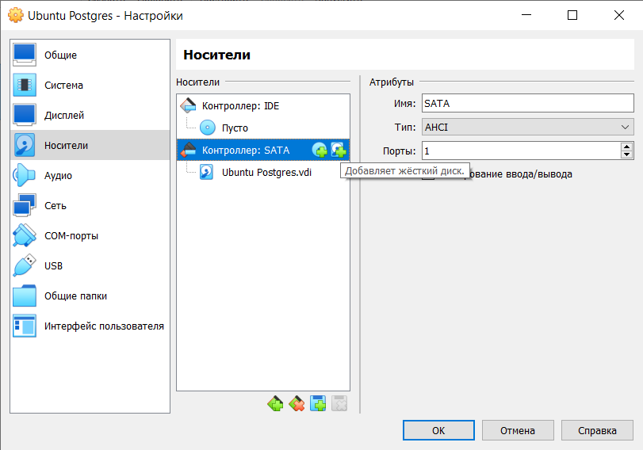
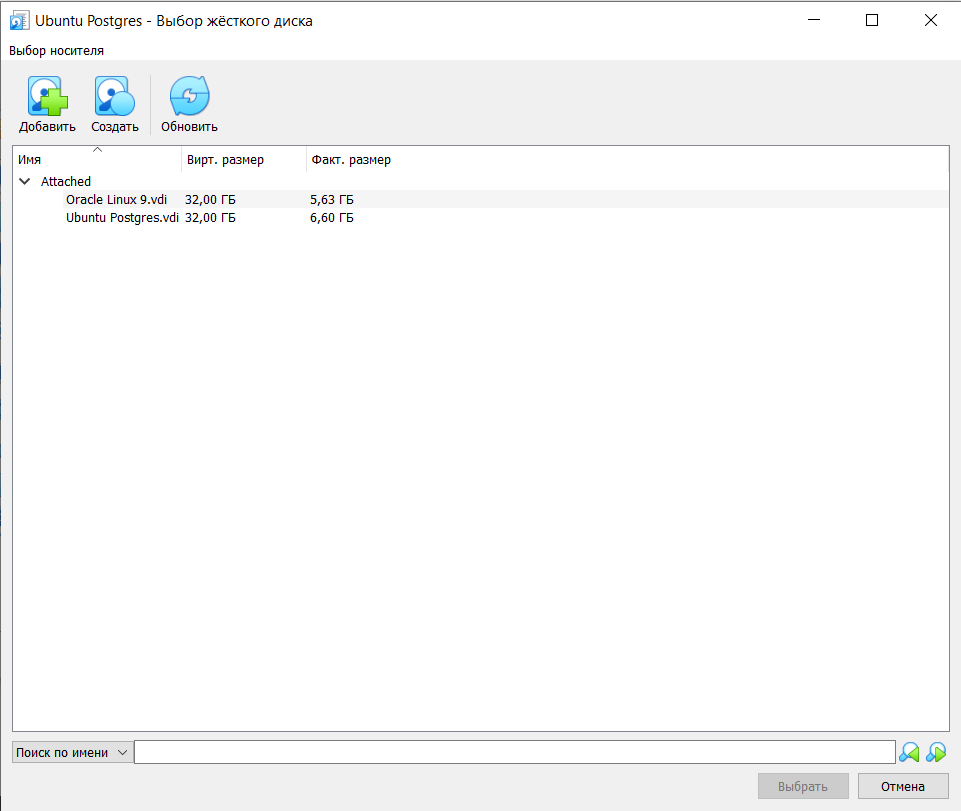
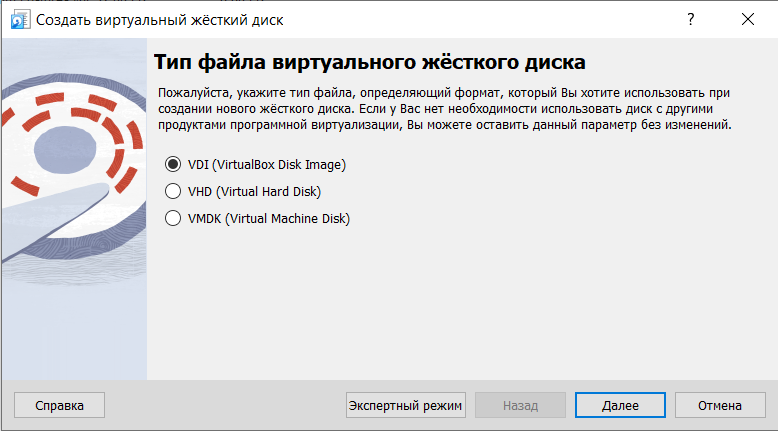
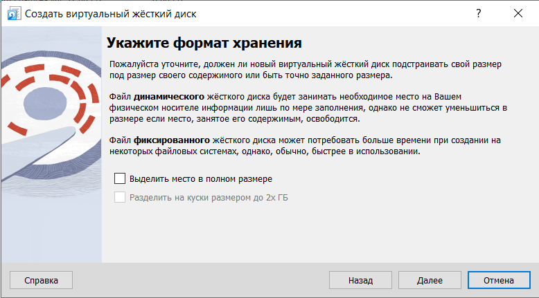
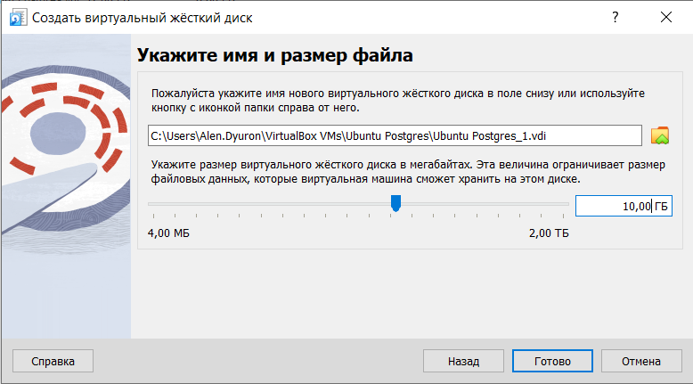
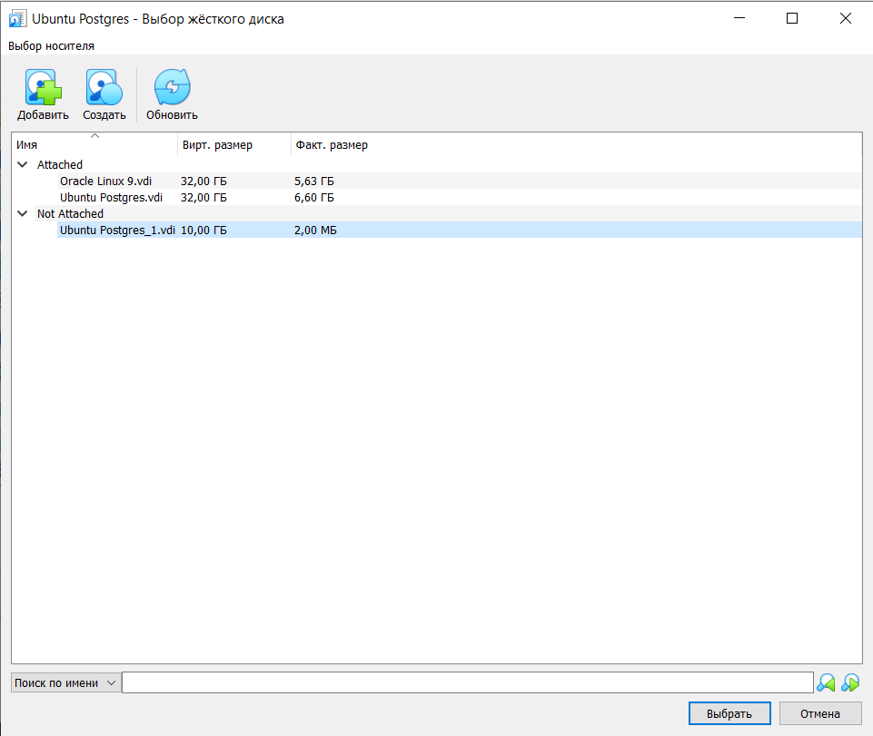
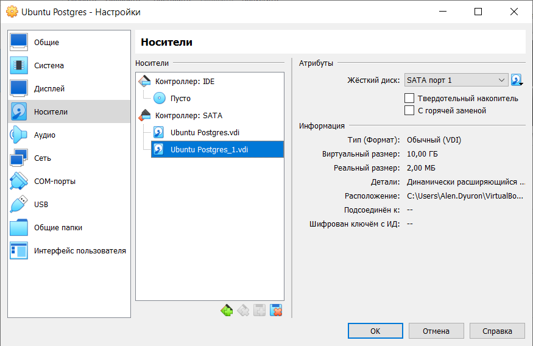

# Установка и настройка PostgreSQL

## Цель

- создавать дополнительный диск для уже существующей виртуальной машины, размечать его и делать на нем файловую систему
- переносить содержимое базы данных PostgreSQL на дополнительный диск
- переносить содержимое БД PostgreSQL между виртуальными машинами

## План

1. создайте виртуальную машину c Ubuntu 20.04/22.04 LTS в ЯО/Virtual Box/докере
2. поставьте на нее PostgreSQL 15 через sudo apt
3. проверьте что кластер запущен через sudo -u postgres pg_lsclusters
4. зайдите из под пользователя postgres в psql и сделайте произвольную таблицу с произвольным содержимым
postgres=# create table test(c1 text);
postgres=# insert into test values('1');
\q
5. остановите postgres например через sudo -u postgres pg_ctlcluster 15 main stop
6. создайте новый диск к ВМ размером 10GB
7. добавьте свеже-созданный диск к виртуальной машине
8. проинициализируйте диск согласно инструкции и подмонтировать файловую систему, только не забывайте менять имя диска на актуальное, в вашем случае это скорее всего будет /dev/sdb - 
9. перезагрузите инстанс и убедитесь, что диск остается примонтированным (если не так смотрим в сторону fstab)
10. сделайте пользователя postgres владельцем /mnt/data - chown -R postgres:postgres /mnt/data/
11. перенесите содержимое /var/lib/postgres/15 в /mnt/data - mv /var/lib/postgresql/15/mnt/data
12. попытайтесь запустить кластер
13. напишите получилось или нет и почему
14. задание: найти конфигурационный параметр в файлах раположенных в /etc/postgresql/15/main который надо поменять и поменяйте его
напишите что и почему поменяли
15. попытайтесь запустить кластер
напишите получилось или нет и почему
16. зайдите через через psql и проверьте содержимое ранее созданной таблицы


> [!NOTE]
> К сожалению в рамках этого DZ не нашел времени для выполнения дополнительного задания со звездочкой
> 
> *задание со звездочкой \*: не удаляя существующий инстанс ВМ сделайте новый, поставьте на его PostgreSQL, удалите файлы с данными из /var/lib/postgres, перемонтируйте внешний диск который сделали ранее от первой виртуальной машины ко второй и запустите PostgreSQL на второй машине так чтобы он работал с данными на внешнем диске, расскажите как вы это сделали и что в итоге получилось.*


## Выполнение


### 1. создайте виртуальную машину c Ubuntu 20.04/22.04 LTS в ЯО/Virtual Box/докере

Мы повторно используем нашу ВМ, создана в рамках первого ДЗ, на Ubuntu 24.04 Server

```sh
aduron@ubt-pg-aduron:~$ uname -a
Linux ubt-pg-aduron 6.8.0-85-generic #85-Ubuntu SMP PREEMPT_DYNAMIC Thu Sep 18 15:26:59 UTC 2025 x86_64 x86_64 x86_64 GNU/Linux
aduron@ubt-pg-aduron:~$ free
               total        used        free      shared  buff/cache   available
Mem:         8132680      483472     7507044       13992      392704     7649208
Swap:              0           0           0
```


### 2. поставьте на нее PostgreSQL 15 через sudo apt

Здесь ничего особо нового, толькло мы специально выбираем версию 15 во время установки

```sh
aduron@ubt-pg-aduron:~$ sudo apt install postgresql-15
[sudo] password for aduron:
Reading package lists... Done
Building dependency tree... Done
Reading state information... Done
The following additional packages will be installed:
  postgresql-client-15
Suggested packages:
  postgresql-doc-15
The following NEW packages will be installed:
  postgresql-15 postgresql-client-15
0 upgraded, 2 newly installed, 0 to remove and 0 not upgraded.
Need to get 17.0 MB of archives.
After this operation, 60.3 MB of additional disk space will be used.
Do you want to continue? [Y/n] y
Get:1 http://apt.postgresql.org/pub/repos/apt noble-pgdg/main amd64 postgresql-client-15 amd64 15.14-1.pgdg24.04+1 [1,720 kB]
Get:2 http://apt.postgresql.org/pub/repos/apt noble-pgdg/main amd64 postgresql-15 amd64 15.14-1.pgdg24.04+1 [15.3 MB]
Fetched 17.0 MB in 1s (11.4 MB/s)
Preconfiguring packages ...
Selecting previously unselected package postgresql-client-15.
(Reading database ... 89966 files and directories currently installed.)
Preparing to unpack .../postgresql-client-15_15.14-1.pgdg24.04+1_amd64.deb ...
Unpacking postgresql-client-15 (15.14-1.pgdg24.04+1) ...
Selecting previously unselected package postgresql-15.
Preparing to unpack .../postgresql-15_15.14-1.pgdg24.04+1_amd64.deb ...
Unpacking postgresql-15 (15.14-1.pgdg24.04+1) ...
Setting up postgresql-client-15 (15.14-1.pgdg24.04+1) ...
Setting up postgresql-15 (15.14-1.pgdg24.04+1) ...
Processing triggers for postgresql-common (285.pgdg24.04+1) ...
Building PostgreSQL dictionaries from installed myspell/hunspell packages...
Removing obsolete dictionary files:
Scanning processes...
Scanning linux images...

Running kernel seems to be up-to-date.

No services need to be restarted.

No containers need to be restarted.

No user sessions are running outdated binaries.

No VM guests are running outdated hypervisor (qemu) binaries on this host.
```


### 3. проверьте что кластер запущен через sudo -u postgres pg_lsclusters

Видимо, из-за того что уже существует кластер другой версии (17), наш кластер в.15 не запускался
```sh
aduron@ubt-pg-aduron:~$ sudo pg_lsclusters
Ver Cluster Port Status Owner    Data directory              Log file
17  main    5432 online postgres /var/lib/postgresql/17/main /var/log/postgresql/postgresql-17-main.log
```

Точне: он просто не существует.
```sh
aduron@ubt-pg-aduron:~$ ls /etc/postgresql
/etc/postgresql:
17
```

Можно его создавать вот следующим образом:
```sh
aduron@ubt-pg-aduron:~$ sudo pg_createcluster 15 main
Creating new PostgreSQL cluster 15/main ...
/usr/lib/postgresql/15/bin/initdb -D /var/lib/postgresql/15/main --auth-local peer --auth-host scram-sha-256 --no-instructions
The files belonging to this database system will be owned by user "postgres".
This user must also own the server process.

The database cluster will be initialized with locale "en_US.UTF-8".
The default database encoding has accordingly been set to "UTF8".
The default text search configuration will be set to "english".

Data page checksums are disabled.

fixing permissions on existing directory /var/lib/postgresql/15/main ... ok
creating subdirectories ... ok
selecting dynamic shared memory implementation ... posix
selecting default max_connections ... 100
selecting default shared_buffers ... 128MB
selecting default time zone ... Etc/UTC
creating configuration files ... ok
running bootstrap script ... ok
performing post-bootstrap initialization ... ok
syncing data to disk ... ok
Ver Cluster Port Status Owner    Data directory              Log file
15  main    5433 down   postgres /var/lib/postgresql/15/main /var/log/postgresql/postgresql-15-main.log
```

И тогда можем уже констатировать что теперь существует, и что по умолчанию был выбран следующий доступный порт 5433 т.к. 5432 в данном случае занят нашим кластером на в.17:
```sh
aduron@ubt-pg-aduron:~$ pg_lsclusters
Ver Cluster Port Status Owner    Data directory              Log file
15  main    5433 down   postgres /var/lib/postgresql/15/main /var/log/postgresql/postgresql-15-main.log
17  main    5432 online postgres /var/lib/postgresql/17/main /var/log/postgresql/postgresql-17-main.log
```

Ладно, запускаем:
```sh
aduron@ubt-pg-aduron:~$ sudo service postgresql start
aduron@ubt-pg-aduron:~$ pg_lsclusters
Ver Cluster Port Status Owner    Data directory              Log file
15  main    5433 online postgres /var/lib/postgresql/15/main /var/log/postgresql/postgresql-15-main.log
17  main    5432 online postgres /var/lib/postgresql/17/main /var/log/postgresql/postgresql-17-main.log
```

Проверка статуса каждой службы можно также таким образом с помощью *systemctl*:
```sh
aduron@ubt-pg-aduron:~$ sudo systemctl status postgresql
[sudo] password for aduron:
● postgresql.service - PostgreSQL RDBMS
     Loaded: loaded (/usr/lib/systemd/system/postgresql.service; enabled; preset: enabled)
     Active: active (exited) since Sun 2025-10-19 07:05:34 UTC; 2h 1min ago
    Process: 1266 ExecStart=/bin/true (code=exited, status=0/SUCCESS)
   Main PID: 1266 (code=exited, status=0/SUCCESS)
        CPU: 1ms

Oct 19 07:05:34 ubt-pg-aduron systemd[1]: Starting postgresql.service - PostgreSQL RDBMS...
Oct 19 07:05:34 ubt-pg-aduron systemd[1]: Finished postgresql.service - PostgreSQL RDBMS.
aduron@ubt-pg-aduron:~$ sudo systemctl status postgresql@15-main
● postgresql@15-main.service - PostgreSQL Cluster 15-main
     Loaded: loaded (/usr/lib/systemd/system/postgresql@.service; enabled-runtime; preset: enabled)
     Active: active (running) since Sun 2025-10-19 07:43:54 UTC; 1h 23min ago
    Process: 1920 ExecStart=/usr/bin/pg_ctlcluster --skip-systemctl-redirect 15-main start (code=exited, status=0/SUCCESS)
   Main PID: 1925 (postgres)
      Tasks: 6 (limit: 9434)
     Memory: 19.3M (peak: 27.0M)
        CPU: 2.200s
     CGroup: /system.slice/system-postgresql.slice/postgresql@15-main.service
             ├─1925 /usr/lib/postgresql/15/bin/postgres -D /mnt/data/15/main -c config_file=/etc/postgresql/15/main/postgresql.conf
             ├─1926 "postgres: 15/main: checkpointer "
             ├─1927 "postgres: 15/main: background writer "
             ├─1929 "postgres: 15/main: walwriter "
             ├─1930 "postgres: 15/main: autovacuum launcher "
             └─1931 "postgres: 15/main: logical replication launcher "

Oct 19 07:43:51 ubt-pg-aduron systemd[1]: Starting postgresql@15-main.service - PostgreSQL Cluster 15-main...
Oct 19 07:43:54 ubt-pg-aduron systemd[1]: Started postgresql@15-main.service - PostgreSQL Cluster 15-main.
aduron@ubt-pg-aduron:~$ sudo systemctl status postgresql@17-main
● postgresql@17-main.service - PostgreSQL Cluster 17-main
     Loaded: loaded (/usr/lib/systemd/system/postgresql@.service; enabled-runtime; preset: enabled)
     Active: active (running) since Sun 2025-10-19 07:05:34 UTC; 2h 1min ago
    Process: 849 ExecStart=/usr/bin/pg_ctlcluster --skip-systemctl-redirect 17-main start (code=exited, status=0/SUCCESS)
   Main PID: 946 (postgres)
      Tasks: 6 (limit: 9434)
     Memory: 35.1M (peak: 41.8M)
        CPU: 3.073s
     CGroup: /system.slice/system-postgresql.slice/postgresql@17-main.service
             ├─946 /usr/lib/postgresql/17/bin/postgres -D /var/lib/postgresql/17/main -c config_file=/etc/postgresql/17/main/postgresql.conf
             ├─954 "postgres: 17/main: checkpointer "
             ├─955 "postgres: 17/main: background writer "
             ├─960 "postgres: 17/main: walwriter "
             ├─961 "postgres: 17/main: autovacuum launcher "
             └─962 "postgres: 17/main: logical replication launcher "

Oct 19 07:05:31 ubt-pg-aduron systemd[1]: Starting postgresql@17-main.service - PostgreSQL Cluster 17-main...
Oct 19 07:05:34 ubt-pg-aduron systemd[1]: Started postgresql@17-main.service - PostgreSQL Cluster 17-main.
```


Проверим что все фаилы на правильном месте
```sh
aduron@ubt-pg-aduron:~$ ls /etc/postgresql
15  17
aduron@ubt-pg-aduron:~$ ls /etc/postgresql/15/main/
conf.d  environment  pg_ctl.conf  pg_hba.conf  pg_ident.conf  postgresql.conf  start.conf
aduron@ubt-pg-aduron:~$ ls /etc/postgresql/17/main/
conf.d  environment  pg_ctl.conf  pg_hba.conf  pg_ident.conf  postgresql.conf  start.conf
```

И проверим что можем подключится к кластерам. Видно что второе подключение создана к серверу на в.15.
```sh
aduron@ubt-pg-aduron:~$ sudo su - postgres
postgres@ubt-pg-aduron:~$ psql -U postgres -p 5432
psql (17.6 (Ubuntu 17.6-2.pgdg24.04+1))
Type "help" for help.

postgres=# exit
postgres@ubt-pg-aduron:~$ psql -U postgres -p 5433
psql (17.6 (Ubuntu 17.6-2.pgdg24.04+1), server 15.14 (Ubuntu 15.14-1.pgdg24.04+1))
Type "help" for help.
```


### 4. зайдите из под пользователя postgres в psql и сделайте произвольную таблицу с произвольным содержимым


Создадим тестовую таблицу с данными:
```sql
postgres=# \l
                                                     List of databases
   Name    |  Owner   | Encoding | Locale Provider |   Collate   |    Ctype    | Locale | ICU Rules |   Access privileges
-----------+----------+----------+-----------------+-------------+-------------+--------+-----------+-----------------------
 postgres  | postgres | UTF8     | libc            | en_US.UTF-8 | en_US.UTF-8 |        |           |
 template0 | postgres | UTF8     | libc            | en_US.UTF-8 | en_US.UTF-8 |        |           | =c/postgres          +
           |          |          |                 |             |             |        |           | postgres=CTc/postgres
 template1 | postgres | UTF8     | libc            | en_US.UTF-8 | en_US.UTF-8 |        |           | =c/postgres          +
           |          |          |                 |             |             |        |           | postgres=CTc/postgres
(3 rows)

postgres=# create table test(c1 text);
CREATE TABLE
postgres=# insert into test values('1');
INSERT 0 1
```


### 5. остановите postgres например через sudo -u postgres pg_ctlcluster 15 main stop

Теперь остановим 15-й кластер:
```sh
aduron@ubt-pg-aduron:~$ sudo pg_ctlcluster 15 main stop
aduron@ubt-pg-aduron:~$ sudo pg_lsclusters
Ver Cluster Port Status Owner    Data directory              Log file
15  main    5433 down   postgres /var/lib/postgresql/15/main /var/log/postgresql/postgresql-15-main.log
17  main    5432 online postgres /var/lib/postgresql/17/main /var/log/postgresql/postgresql-17-main.log
```


### 6. создайте новый диск к ВМ размером 10GB

Для этого нужно остановить наш ВМ
```sh
aduron@ubt-pg-aduron:~$ 
Broadcast message from aduron@ubt-pg-aduron on tty1 (Sun 2025-10-19 06:48:40 UTC):

The system will power off now!
Using username "aduron".
Authenticating with public key "rsa-key-20241127"
```

Для добавления нового диска, открываем "настройки" ВМ, раздел "носители" и добавим жёсткий диск.



Здесь выбираем "Создать".



Выбираем VDI вид диска.



Здесь оставим как есть, чтобы получить динамическое выделение места.



Определить размер и местоположение файла.



После создания диска будет доступен для выбора в разделе "Not attached".



В конце процесса выбираем OK.




### 7. добавьте свеже-созданный диск к виртуальной машине

После перезапуска ВМ, проверим что новый диск размера 10ГБ существует
```sh
aduron@ubt-pg-aduron:~$ lsblk
NAME                      MAJ:MIN RM  SIZE RO TYPE MOUNTPOINTS
sda                         8:0    0   32G  0 disk
├─sda1                      8:1    0    1M  0 part
├─sda2                      8:2    0    2G  0 part /boot
└─sda3                      8:3    0   30G  0 part
  └─ubuntu--vg-ubuntu--lv 252:0    0   15G  0 lvm  /
sdb                         8:16   0   10G  0 disk
sr0                        11:0    1 1024M  0 rom
```


### 8. проинициализируйте диск согласно инструкции и подмонтировать файловую систему

Партиционировать новый диск с коммандой *fdisk*
```sh
aduron@ubt-pg-aduron:~$ sudo fdisk /dev/sdb
[sudo] password for aduron:

Welcome to fdisk (util-linux 2.39.3).
Changes will remain in memory only, until you decide to write them.
Be careful before using the write command.

Device does not contain a recognized partition table.
Created a new DOS (MBR) disklabel with disk identifier 0xa84d627d.

Command (m for help): n
Partition type
   p   primary (0 primary, 0 extended, 4 free)
   e   extended (container for logical partitions)
Select (default p): p
Partition number (1-4, default 1):
First sector (2048-20971519, default 2048):
Last sector, +/-sectors or +/-size{K,M,G,T,P} (2048-20971519, default 20971519):

Created a new partition 1 of type 'Linux' and of size 10 GiB.

Command (m for help): w
The partition table has been altered.
Calling ioctl() to re-read partition table.
Syncing disks.
```

Далее форматируем партицию 
```sh
aduron@ubt-pg-aduron:~$ sudo mkfs.ext4 /dev/sdb1
mke2fs 1.47.0 (5-Feb-2023)
Creating filesystem with 2621184 4k blocks and 655360 inodes
Filesystem UUID: 507aac2d-2775-487c-819e-5a8c95b84ab4
Superblock backups stored on blocks:
        32768, 98304, 163840, 229376, 294912, 819200, 884736, 1605632

Allocating group tables: done
Writing inode tables: done
Creating journal (16384 blocks): done
Writing superblocks and filesystem accounting information: done
```

... и подмонтируем её
```sh
aduron@ubt-pg-aduron:~$ sudo mkdir /mnt/data
aduron@ubt-pg-aduron:~$ sudo mount /dev/sdb1 /mnt/data
aduron@ubt-pg-aduron:~$ df -h
Filesystem                         Size  Used Avail Use% Mounted on
tmpfs                              795M  1.1M  794M   1% /run
/dev/mapper/ubuntu--vg-ubuntu--lv   15G  4.2G  9.8G  31% /
tmpfs                              3.9G  2.1M  3.9G   1% /dev/shm
tmpfs                              5.0M     0  5.0M   0% /run/lock
/dev/sda2                          2.0G  102M  1.7G   6% /boot
tmpfs                              795M   12K  795M   1% /run/user/1000
/dev/sdb1                          9.8G   24K  9.3G   1% /mnt/data
```


### 9. перезагрузите инстанс и убедитесь, что диск остается примонтированным (если не так смотрим в сторону fstab)

Для того чтобы убедиться что проблем не будет при перезапуске сервера, добавим новое монтированое пространствро в файл *fstab*
```sh
aduron@ubt-pg-aduron:~$ ls -lrt /dev/disk/by-uuid/
total 0
lrwxrwxrwx 1 root root 10 Oct 19 06:55 b59f471c-bec1-49f0-847e-fa5857148140 -> ../../sda2
lrwxrwxrwx 1 root root 10 Oct 19 06:55 b9019b4d-2fcd-4675-815d-76b532c6c58c -> ../../dm-0
lrwxrwxrwx 1 root root 10 Oct 19 06:59 507aac2d-2775-487c-819e-5a8c95b84ab4 -> ../../sdb1
aduron@ubt-pg-aduron:~$ sudo su -
root@ubt-pg-aduron:~# echo "/dev/disk/by-uuid/507aac2d-2775-487c-819e-5a8c95b84ab4 /mnt/data ext4 defaults 0 1" >> /etc/fstab
root@ubt-pg-aduron:~# cat /etc/fstab
# /etc/fstab: static file system information.
#
# Use 'blkid' to print the universally unique identifier for a
# device; this may be used with UUID= as a more robust way to name devices
# that works even if disks are added and removed. See fstab(5).
#
# <file system> <mount point>   <type>  <options>       <dump>  <pass>
# / was on /dev/ubuntu-vg/ubuntu-lv during curtin installation
/dev/disk/by-id/dm-uuid-LVM-l5ejJjVuuT4wNbUg8Csou903unpUqyTJlmuXLMWOsZtTC3P8PuwUM0PcC3FFp1IY / ext4 defaults 0 1
# /boot was on /dev/sda2 during curtin installation
/dev/disk/by-uuid/b59f471c-bec1-49f0-847e-fa5857148140 /boot ext4 defaults 0 1
/dev/disk/by-uuid/507aac2d-2775-487c-819e-5a8c95b84ab4 /mnt/data ext4 defaults 0 1

root@ubt-pg-aduron:~# reboot

Broadcast message from root@ubt-pg-aduron on pts/1 (Sun 2025-10-19 07:05:18 UTC):

The system will reboot now!

```

Проверим, что при запуске сервера диск остается примонтированным
```sh
aduron@ubt-pg-aduron:~$ df -h
Filesystem                         Size  Used Avail Use% Mounted on
tmpfs                              795M  1.2M  794M   1% /run
/dev/mapper/ubuntu--vg-ubuntu--lv   15G  4.2G  9.8G  31% /
tmpfs                              3.9G  2.1M  3.9G   1% /dev/shm
tmpfs                              5.0M     0  5.0M   0% /run/lock
/dev/sda2                          2.0G  102M  1.7G   6% /boot
/dev/sdb1                          9.8G   24K  9.3G   1% /mnt/data
tmpfs                              795M   12K  795M   1% /run/user/1000
```


### 10. сделайте пользователя postgres владельцем /mnt/data - chown -R postgres:postgres /mnt/data/


```sh
aduron@ubt-pg-aduron:~$ sudo chown -R postgres:postgres /mnt/data/
[sudo] password for aduron:
aduron@ubt-pg-aduron:~$ ls -lrt /mnt/data/
total 16
drwx------ 2 postgres postgres 16384 Oct 19 06:59 lost+found
```


### 11. перенесите содержимое /var/lib/postgres/15 в /mnt/data - mv /var/lib/postgresql/15/mnt/data

Стопнуть 15-й кластер:
```sh
aduron@ubt-pg-aduron:~$ sudo pg_lsclusters
Ver Cluster Port Status Owner    Data directory              Log file
15  main    5433 online postgres /var/lib/postgresql/15/main /var/log/postgresql/postgresql-15-main.log
17  main    5432 online postgres /var/lib/postgresql/17/main /var/log/postgresql/postgresql-17-main.log

aduron@ubt-pg-aduron:~$ sudo systemctl stop postgresql@15-main
aduron@ubt-pg-aduron:~$ sudo pg_lsclusters
Ver Cluster Port Status Owner    Data directory              Log file
15  main    5433 down   postgres /var/lib/postgresql/15/main /var/log/postgresql/postgresql-15-main.log
17  main    5432 online postgres /var/lib/postgresql/17/main /var/log/postgresql/postgresql-17-main.log
```

> [!TIP]
> В Ubuntu, при попытке остановить кластер с *sudo -u postgres pg_ctlcluster 15 main stop* получаем такое сообщение:
> 
> *Warning: stopping the cluster using pg_ctlcluster will mark the systemd unit as failed. Consider using systemctl:
  sudo systemctl stop postgresql@15-main*

Дальше мы перенесём *data_directory* 15-ого кластера в */mnt/data*
```sh
aduron@ubt-pg-aduron:~$ sudo mv /var/lib/postgresql/15 /mnt/data/
aduron@ubt-pg-aduron:~$ ls -lrt /mnt/data/
total 20
drwxr-xr-x 3 postgres postgres  4096 Oct 19 06:30 15
drwx------ 2 postgres postgres 16384 Oct 19 06:59 lost+found
```


### 12. попытайтесь запустить кластер - sudo -u postgres pg_ctlcluster 15 main start

```sh
aduron@ubt-pg-aduron:~$ sudo pg_ctlcluster 15 main start
Error: /var/lib/postgresql/15/main is not accessible or does not exist
```


### 13. напишите получилось или нет и почему

Так не получится, потому что как указано в *pg_lscluster* сервер постгреса всё же настроен с *Data Directory* в */var/lib/postgresql/15/main*
```sh
aduron@ubt-pg-aduron:~$ pg_lsclusters
Ver Cluster Port Status Owner     Data directory              Log file
15  main    5433 down   <unknown> /var/lib/postgresql/15/main /var/log/postgresql/postgresql-15-main.log
17  main    5432 online postgres  /var/lib/postgresql/17/main /var/log/postgresql/postgresql-17-main.log
```


### 14. задание: найти конфигурационный параметр в файлах раположенных в /etc/postgresql/15/main который надо поменять и поменяйте его

Попрубуем узнавать, где в postgresql.conf находится значение местоположения *Data Directory*
```sh
postgres@ubt-pg-aduron:/etc/postgresql/15/main$ grep "15/main" postgresql.conf
data_directory = '/var/lib/postgresql/15/main'          # use data in another directory
hba_file = '/etc/postgresql/15/main/pg_hba.conf'        # host-based authentication file
ident_file = '/etc/postgresql/15/main/pg_ident.conf'    # ident configuration file
cluster_name = '15/main'                        # added to process titles if nonempty
```

Скопируем *postgres.conf* в *postgresql.conf_backup* на всякий случае, затем меняем значение на */mnt/data/15/main*
```sh
postgres@ubt-pg-aduron:/etc/postgresql/15/main$ sed -i 's/\/var\/lib\/postgresql\/15\/main/\/mnt\/data\/15\/main/g' postgresql.conf
postgres@ubt-pg-aduron:/etc/postgresql/15/main$ grep data_directory postgresql.conf
data_directory = '/mnt/data/15/main'            # use data in another directory
```


### 15. попытайтесь запустить кластер

Здесь конечно получается его запустить
```sh
aduron@ubt-pg-aduron:~$ tail -f /var/log/postgresql/postgresql-15-main.log &
aduron@ubt-pg-aduron:~$ sudo pg_ctlcluster 15 main start
2025-10-19 07:19:40.153 UTC [1615] LOG:  starting PostgreSQL 15.14 (Ubuntu 15.14-1.pgdg24.04+1) on x86_64-pc-linux-gnu, compiled by gcc (Ubuntu 13.3.0-6ubuntu2~24.04) 13.3.0, 64-bit
2025-10-19 07:19:40.154 UTC [1615] LOG:  listening on IPv4 address "127.0.0.1", port 5433
2025-10-19 07:19:40.156 UTC [1615] LOG:  listening on Unix socket "/var/run/postgresql/.s.PGSQL.5433"
2025-10-19 07:19:40.163 UTC [1618] LOG:  database system was shut down at 2025-10-19 07:08:52 UTC
2025-10-19 07:19:40.170 UTC [1615] LOG:  database system is ready to accept connections
aduron@ubt-pg-aduron:~$


```sh
aduron@ubt-pg-aduron:~$ sudo pg_lsclusters
Ver Cluster Port Status Owner    Data directory              Log file
15  main    5433 online postgres /mnt/data/15/main           /var/log/postgresql/postgresql-15-main.log
17  main    5432 online postgres /var/lib/postgresql/17/main /var/log/postgresql/postgresql-17-main.log
```

Проверим что наша тестовая таблица осталась на месте
```sql
postgres@ubt-pg-aduron:~$ psql -U postgres -p 5433
psql (17.6 (Ubuntu 17.6-2.pgdg24.04+1), server 15.14 (Ubuntu 15.14-1.pgdg24.04+1))
Type "help" for help.

postgres=# select * from test;
 c1
----
 1
(1 row)
```

А что, если не менять postgresql.conf а просто создавать symlink */var/lib/postgresql/15/main* к */mnt/data/15/main* ?
Попробуем:
```sh
aduron@ubt-pg-aduron:~$ sudo systemctl stop postgresql@15-main
aduron@ubt-pg-aduron:~$ sudo systemctl stop postgresql@15-main
2025-10-19 07:20:32.407 UTC [1615] LOG:  received fast shutdown request
2025-10-19 07:20:32.410 UTC [1615] LOG:  aborting any active transactions
2025-10-19 07:20:32.414 UTC [1615] LOG:  background worker "logical replication launcher" (PID 1621) exited with exit code 1
2025-10-19 07:20:32.415 UTC [1616] LOG:  shutting down
2025-10-19 07:20:32.419 UTC [1616] LOG:  checkpoint starting: shutdown immediate
2025-10-19 07:20:32.429 UTC [1616] LOG:  checkpoint complete: wrote 3 buffers (0.0%); 0 WAL file(s) added, 0 removed, 0 recycled; write=0.003 s, sync=0.002 s, total=0.015 s; sync files=2, longest=0.001 s, average=0.001 s; distance=0 kB, estimate=0 kB
2025-10-19 07:20:32.435 UTC [1615] LOG:  database system is shut down
```

```sh
postgres@ubt-pg-aduron:/etc/postgresql/15/main$ cp postgresql.conf postgresql.conf_good
postgres@ubt-pg-aduron:/etc/postgresql/15/main$ mv postgresql.conf_backup postgresql.conf
```

```sh
root@ubt-pg-aduron:~# mkdir /var/lib/postgresql/15
root@ubt-pg-aduron:~# ln -s /mnt/data/15/main /var/lib/postgresql/15/main
root@ubt-pg-aduron:~# ls -lrt /var/lib/postgresql/15/main
lrwxrwxrwx 1 root root 17 Oct 19 07:31 /var/lib/postgresql/15/main -> /mnt/data/15/main
```

Проверим что при востановления старого postgresql.conf, pg_lsclusters видит старое местоположение каталога.
При этом *Owner* снова виден как *postgres*, так как существует ссылка к каталогу.
Кластер успешно запускается
```sh
aduron@ubt-pg-aduron:~$ sudo pg_ctlcluster 15 main start
2025-10-19 07:32:24.446 UTC [1805] LOG:  starting PostgreSQL 15.14 (Ubuntu 15.14-1.pgdg24.04+1) on x86_64-pc-linux-gnu, compiled by gcc (Ubuntu 13.3.0-6ubuntu2~24.04) 13.3.0, 64-bit
                                                                                                                                  2025-10-19 07:32:24.447 UTC [1805] LOG:  listening on IPv4 address "127.0.0.1", port 5433
2025-10-19 07:32:24.450 UTC [1805] LOG:  listening on Unix socket "/var/run/postgresql/.s.PGSQL.5433"
2025-10-19 07:32:24.456 UTC [1808] LOG:  database system was shut down at 2025-10-19 07:20:32 UTC
2025-10-19 07:32:24.470 UTC [1805] LOG:  database system is ready to accept connections

aduron@ubt-pg-aduron:~$ sudo pg_lsclusters
Ver Cluster Port Status Owner    Data directory              Log file
15  main    5433 online postgres /var/lib/postgresql/15/main /var/log/postgresql/postgresql-15-main.log
17  main    5432 online postgres /var/lib/postgresql/17/main /var/log/postgresql/postgresql-17-main.log

aduron@ubt-pg-aduron:~$ sudo su - postgres
```


### 16. зайдите через через psql и проверьте содержимое ранее созданной таблицы

Наконец проверим что можем успешно запросить данные из *test*
```sql
postgres@ubt-pg-aduron:~$ psql -U postgres -p 5433
psql (17.6 (Ubuntu 17.6-2.pgdg24.04+1), server 15.14 (Ubuntu 15.14-1.pgdg24.04+1))
Type "help" for help.

postgres=# select * from test;
 c1
----
 1
(1 row)
```
