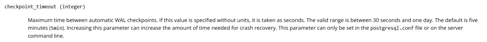
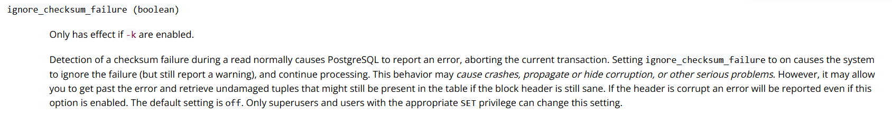

# Работа с журналами

## Цель

- уметь работать с журналами и контрольными точками
- уметь настраивать параметры журналов

## План

1. Настройте выполнение контрольной точки раз в 30 секунд.
2. 10 минут c помощью утилиты pgbench подавайте нагрузку.
3. Измерьте, какой объем журнальных файлов был сгенерирован за это время. Оцените, какой объем приходится в среднем на одну контрольную точку.
4. Проверьте данные статистики: все ли контрольные точки выполнялись точно по расписанию. Почему так произошло?
5. Сравните tps в синхронном/асинхронном режиме утилитой pgbench. Объясните полученный результат.
6. Создайте новый кластер с включенной контрольной суммой страниц. Создайте таблицу. Вставьте несколько значений. Выключите кластер. Измените пару байт в таблице. Включите кластер и сделайте выборку из таблицы. Что и почему произошло? как проигнорировать ошибку и продолжить работу?


## Выполнение

> [!NOTE]
> Для выполнения этого ДЗ пользуемся кластером в 17 с дефольтними настройками. Остальние кластера на ВМ, как обычно, будут отключены. 

Соответственно отключаем в.15 и в.14:
```sh
aduron@ubt-pg-aduron:~$ sudo systemctl stop postgresql@15-main
aduron@ubt-pg-aduron:~$ sudo systemctl stop postgresql@14-main
aduron@ubt-pg-aduron:~$ sudo pg_lsclusters
Ver Cluster Port Status Owner    Data directory              Log file
14  main    5434 down   postgres /var/lib/postgresql/14/main /var/log/postgresql/postgresql-14-main.log
15  main    5433 down   postgres /mnt/data/15/main           /var/log/postgresql/postgresql-15-main.log
17  main    5432 online postgres /var/lib/postgresql/17/main /var/log/postgresql/postgresql-17-main.log
```


### 1. Настройте выполнение контрольной точки раз в 30 секунд.

Вот все настройки предположительно связанны с контрольними точками:
```sql
postgres=# select name , setting, unit from pg_settings
where name like '%check%';
               name               | setting | unit
----------------------------------+---------+------
 check_function_bodies            | on      |
 checkpoint_completion_target     | 0.9     |
 checkpoint_flush_after           | 32      | 8kB
 checkpoint_timeout               | 300     | s
 checkpoint_warning               | 30      | s
 client_connection_check_interval | 0       | ms
 data_checksums                   | off     |
 ignore_checksum_failure          | off     |
 log_checkpoints                  | on      |
 wal_consistency_checking         |         |
(10 rows)
```



Соответственно поменяем checkpoint_timeout:
```sql
postgres=# alter system set checkpoint_timeout=30;
ALTER SYSTEM
postgres=# SELECT pg_reload_conf();
 pg_reload_conf
----------------
 t
(1 row)

postgres=# select name , setting, unit from pg_settings
where name like '%check%';
               name               | setting | unit
----------------------------------+---------+------
 check_function_bodies            | on      |
 checkpoint_completion_target     | 0.9     |
 checkpoint_flush_after           | 32      | 8kB
 checkpoint_timeout               | 30      | s
 checkpoint_warning               | 30      | s
 client_connection_check_interval | 0       | ms
 data_checksums                   | off     |
 ignore_checksum_failure          | off     |
 log_checkpoints                  | on      |
 wal_consistency_checking         |         |
(10 rows)
```

```sql
aduron@ubt-pg-aduron:~$ sudo tail -f /var/log/postgresql/postgresql-17-main.log
[...]
2025-11-16 19:21:21.446 UTC [1694] LOG:  received SIGHUP, reloading configuration files
2025-11-16 19:21:21.447 UTC [1694] LOG:  parameter "checkpoint_timeout" changed to "30"
```

Отлично! ждем 30 сек и видим... ничего.
По краиней мере до того, как мы начинаем ставить данные:

```sql
postgres=# insert into persons (first_name,second_name) values ('alan', 'alanov');
INSERT 0 1
postgres=# select current_timestamp;
       current_timestamp
-------------------------------
 2025-11-16 19:59:37.870051+00
(1 row)

postgres=# insert into persons (first_name,second_name) values ('alan', 'alanov');
INSERT 0 1
postgres=# select current_timestamp;
       current_timestamp
-------------------------------
 2025-11-16 20:00:14.653353+00
(1 row)

postgres=# insert into persons (first_name,second_name) values ('alan', 'alanov');
INSERT 0 1
postgres=# select current_timestamp;
       current_timestamp
-------------------------------
 2025-11-16 20:00:36.456182+00
(1 row)
```

И тогда появляются контрольные точки 30 сек после предыдушего, если данные вбиты в этот же интервал времени: 
```sh
2025-11-16 20:00:02.854 UTC [2025] LOG:  checkpoint starting: time
2025-11-16 20:00:03.093 UTC [2025] LOG:  checkpoint complete: wrote 3 buffers (0.0%); 0 WAL file(s) added, 0 removed, 0 recycled; write=0.232 s, sync=0.002 s, total=0.239 s; sync files=3, longest=0.001 s, average=0.001 s; distance=0 kB, estimate=0 kB; lsn=0/1570198, redo lsn=0/1570108
2025-11-16 20:00:32.144 UTC [2025] LOG:  checkpoint starting: time
2025-11-16 20:00:32.424 UTC [2025] LOG:  checkpoint complete: wrote 3 buffers (0.0%); 0 WAL file(s) added, 0 removed, 0 recycled; write=0.261 s, sync=0.006 s, total=0.280 s; sync files=3, longest=0.004 s, average=0.002 s; distance=0 kB, estimate=0 kB; lsn=0/1570520, redo lsn=0/15704C8
2025-11-16 20:01:02.472 UTC [2025] LOG:  checkpoint starting: time
2025-11-16 20:01:02.746 UTC [2025] LOG:  checkpoint complete: wrote 3 buffers (0.0%); 0 WAL file(s) added, 0 removed, 0 recycled; write=0.262 s, sync=0.005 s, total=0.275 s; sync files=3, longest=0.003 s, average=0.002 s; distance=0 kB, estimate=0 kB; lsn=0/15708D0, redo lsn=0/1570878
```

Если нет никакой активности в базе, то смысла выполнить контрольную точку нет:
```sql
postgres=# SELECT current_timestamp, * FROM pg_control_checkpoint() \gx
-[ RECORD 1 ]--------+------------------------------
current_timestamp    | 2025-11-16 20:02:13.461196+00   <<<< 1 мин. спустя без активности...
checkpoint_lsn       | 0/15708D0
redo_lsn             | 0/1570878  
redo_wal_file        | 000000010000000000000001
timeline_id          | 1
prev_timeline_id     | 1
full_page_writes     | t
next_xid             | 0:763
next_oid             | 16402
next_multixact_id    | 1
next_multi_offset    | 0
oldest_xid           | 730
oldest_xid_dbid      | 1
oldest_active_xid    | 763
oldest_multi_xid     | 1
oldest_multi_dbid    | 1
oldest_commit_ts_xid | 0
newest_commit_ts_xid | 0
checkpoint_time      | 2025-11-16 20:01:02+00
```


### 2. 10 минут c помощью утилиты pgbench подавайте нагрузку.

Сначала запускаем инициализацию:
```sh
aduron@ubt-pg-aduron:~$ pgbench -h 192.168.56.10 -U postgres -p 5432 -d postgres -i
Password:
dropping old tables...
NOTICE:  table "pgbench_accounts" does not exist, skipping
NOTICE:  table "pgbench_branches" does not exist, skipping
NOTICE:  table "pgbench_history" does not exist, skipping
NOTICE:  table "pgbench_tellers" does not exist, skipping
creating tables...
generating data (client-side)...
vacuuming...
creating primary keys...
done in 0.19 s (drop tables 0.00 s, create tables 0.01 s, client-side generate 0.08 s, vacuum 0.05 s, primary keys 0.05 s).
```

Потом выполняем сам pgbench
```sh
aduron@ubt-pg-aduron:~$ date
Mon Nov 17 06:46:20 PM UTC 2025
aduron@ubt-pg-aduron:~$ pgbench -h 192.168.56.10 -U postgres -p 5432 -d postgres -c 8 -P 60 -T 600
Password:
pgbench (17.6 (Ubuntu 17.6-2.pgdg24.04+1))
starting vacuum...end.
progress: 60.0 s, 1726.1 tps, lat 4.620 ms stddev 3.052, 0 failed
progress: 120.0 s, 1945.8 tps, lat 4.106 ms stddev 2.622, 0 failed
progress: 180.0 s, 1956.9 tps, lat 4.083 ms stddev 2.593, 0 failed
progress: 240.0 s, 1918.5 tps, lat 4.165 ms stddev 2.719, 0 failed
progress: 300.0 s, 1955.1 tps, lat 4.087 ms stddev 2.623, 0 failed
progress: 360.0 s, 1948.2 tps, lat 4.102 ms stddev 2.604, 0 failed
progress: 420.0 s, 1944.1 tps, lat 4.110 ms stddev 2.627, 0 failed
progress: 480.0 s, 1951.5 tps, lat 4.095 ms stddev 2.600, 0 failed
progress: 540.0 s, 1979.2 tps, lat 4.037 ms stddev 2.560, 0 failed
progress: 600.0 s, 1913.7 tps, lat 4.176 ms stddev 2.750, 0 failed
transaction type: <builtin: TPC-B (sort of)>
scaling factor: 1
query mode: simple
number of clients: 8
number of threads: 1
maximum number of tries: 1
duration: 600 s
number of transactions actually processed: 1154359
number of failed transactions: 0 (0.000%)
latency average = 4.153 ms
latency stddev = 2.678 ms
initial connection time = 116.086 ms
tps = 1924.250765 (without initial connection time)
aduron@ubt-pg-aduron:~$ date
Mon Nov 17 06:56:31 PM UTC 2025
```


### 3. Измерьте, какой объем журнальных файлов был сгенерирован за это время. Оцените, какой объем приходится в среднем на одну контрольную точку.

> [!NOTE]
> Для этого можно было бы пользоваться расширением *pageinspect* но в данном случае решил использовать это [очень интересное решение](https://estuary.dev/blog/measuring-postgresql-wal-throughput/), разработанное на основе pg_cron, и которое позволяем архивировать с определённым интервалом объём журнальных файлов, для дальнейшего анализа.

```sql
postgres=# select * from wal_volume_analytics;
           timestamp           | lsn_position | wal_bytes_since_previous | wal_size_since_previous | bytes_per_second | rate_pretty | seconds_since_previous
-------------------------------+--------------+--------------------------+-------------------------+------------------+-------------+------------------------
 2025-11-17 18:56:00.008489+00 | 0/85827258   |                 84378504 | 80 MB                   |       1406358.77 | 1373 kB/s   |              59.997851
 2025-11-17 18:55:00.010638+00 | 0/807AEED0   |                 85295640 | 81 MB                   |       1421616.34 | 1388 kB/s   |              59.999057
 2025-11-17 18:54:00.011581+00 | 0/7B656CB8   |                 84626336 | 81 MB                   |       1410475.18 | 1377 kB/s   |              59.998458
 2025-11-17 18:53:00.013123+00 | 0/765A2118   |                 84906520 | 81 MB                   |       1414985.19 | 1382 kB/s   |              60.005236
 2025-11-17 18:52:00.007887+00 | 0/714A8F00   |                 84773184 | 81 MB                   |       1412992.37 | 1380 kB/s   |              59.995500
 2025-11-17 18:51:00.012387+00 | 0/6C3D05C0   |                 84568656 | 81 MB                   |       1409420.26 | 1376 kB/s   |              60.002441
 2025-11-17 18:50:00.009946+00 | 0/67329B70   |                 84579448 | 81 MB                   |       1409728.92 | 1377 kB/s   |              59.996959
 2025-11-17 18:49:00.012987+00 | 0/622806F8   |                 84981648 | 81 MB                   |       1416412.29 | 1383 kB/s   |              59.997819
 2025-11-17 18:48:00.015168+00 | 0/5D174F68   |                 84269296 | 80 MB                   |       1404455.36 | 1372 kB/s   |              60.001406
 2025-11-17 18:47:00.013762+00 | 0/58117678   |                 50661176 | 48 MB                   |        844359.01 | 825 kB/s    |              59.999568
 2025-11-17 18:46:00.014194+00 | 0/550C6F40   |                     8472 | 8472 bytes              |           141.23 | 141 bytes/s |              59.985132
 [...]
(12 rows)

postgres=# select * from wal_volume_summary;
     window      | samples | total_wal_size | avg_wal_per_minute | avg_rate
-----------------+---------+----------------+--------------------+-----------
 Last 5 minutes  |       5 | 404 MB         | 81 MB              | 1380 kB/s
 Last 10 minutes |      10 | 775 MB         | 78 MB              | 1323 kB/s <<< Интервал выполнения pgbench >>>
 Last hour       |      12 | 1047 MB        | 87 MB              | 298 kB/s
 Last day        |      12 | 1047 MB        | 87 MB              | 12 kB/s
(4 rows)
```


### 4. Проверьте данные статистики: все ли контрольные точки выполнялись точно по расписанию. Почему так произошло?

```sh
aduron@ubt-pg-aduron:~$ grep "checkpoint complete" /var/log/postgresql/postgresql-17-main.log | grep "2025-11-17 18:4"

<<< Появление контрольных точек каждая минута, из-за выполнения pg_cron >>>

2025-11-17 18:40:23.882 UTC [2158] LOG:  checkpoint complete: wrote 4 buffers (0.0%); 0 WAL file(s) added, 0 removed, 0 recycled; write=0.365 s, sync=0.006 s, total=0.384 s; sync files=4, longest=0.003 s, average=0.002 s; distance=5 kB, estimate=32522 kB; lsn=0/550BCFB8, redo lsn=0/550BCF60
2025-11-17 18:41:24.320 UTC [2158] LOG:  checkpoint complete: wrote 4 buffers (0.0%); 0 WAL file(s) added, 0 removed, 0 recycled; write=0.362 s, sync=0.009 s, total=0.389 s; sync files=4, longest=0.005 s, average=0.003 s; distance=5 kB, estimate=29270 kB; lsn=0/550BE558, redo lsn=0/550BE500
2025-11-17 18:42:24.280 UTC [2158] LOG:  checkpoint complete: wrote 4 buffers (0.0%); 0 WAL file(s) added, 0 removed, 0 recycled; write=0.315 s, sync=0.004 s, total=0.332 s; sync files=4, longest=0.003 s, average=0.001 s; distance=5 kB, estimate=26343 kB; lsn=0/550BFC78, redo lsn=0/550BFC20
2025-11-17 18:42:32.560 UTC [2158] LOG:  checkpoint complete: wrote 0 buffers (0.0%); 0 WAL file(s) added, 0 removed, 0 recycled; write=0.001 s, sync=0.001 s, total=0.005 s; sync files=0, longest=0.000 s, average=0.000 s; distance=0 kB, estimate=23709 kB; lsn=0/550BFD28, redo lsn=0/550BFD28
2025-11-17 18:43:03.255 UTC [2399] LOG:  checkpoint complete: wrote 6 buffers (0.0%); 0 WAL file(s) added, 0 removed, 0 recycled; write=0.431 s, sync=0.002 s, total=0.445 s; sync files=5, longest=0.001 s, average=0.001 s; distance=6 kB, estimate=6 kB; lsn=0/550C15E8, redo lsn=0/550C1558
2025-11-17 18:44:02.679 UTC [2399] LOG:  checkpoint complete: wrote 4 buffers (0.0%); 0 WAL file(s) added, 0 removed, 0 recycled; write=0.329 s, sync=0.005 s, total=0.349 s; sync files=4, longest=0.003 s, average=0.002 s; distance=6 kB, estimate=6 kB; lsn=0/550C3040, redo lsn=0/550C2FE8
2025-11-17 18:45:03.456 UTC [2399] LOG:  checkpoint complete: wrote 8 buffers (0.0%); 0 WAL file(s) added, 0 removed, 0 recycled; write=0.740 s, sync=0.009 s, total=0.758 s; sync files=8, longest=0.005 s, average=0.002 s; distance=8 kB, estimate=8 kB; lsn=0/550C50E0, redo lsn=0/550C5088
2025-11-17 18:46:03.284 UTC [2399] LOG:  checkpoint complete: wrote 7 buffers (0.0%); 0 WAL file(s) added, 0 removed, 0 recycled; write=0.639 s, sync=0.008 s, total=0.664 s; sync files=7, longest=0.005 s, average=0.002 s; distance=8 kB, estimate=8 kB; lsn=0/550C7280, redo lsn=0/550C7228

<<< Запуск pgbench >>>

2025-11-17 18:46:59.092 UTC [2399] LOG:  checkpoint complete: wrote 1696 buffers (10.4%); 0 WAL file(s) added, 0 removed, 0 recycled; write=26.792 s, sync=0.004 s, total=26.799 s; sync files=16, longest=0.002 s, average=0.001 s; distance=14859 kB, estimate=14859 kB; lsn=0/58046F38, redo lsn=0/55F4A0B8
2025-11-17 18:47:29.092 UTC [2399] LOG:  checkpoint complete: wrote 2113 buffers (12.9%); 0 WAL file(s) added, 0 removed, 3 recycled; write=26.977 s, sync=0.004 s, total=26.997 s; sync files=16, longest=0.002 s, average=0.001 s; distance=36448 kB, estimate=36448 kB; lsn=0/5A83DFA0, redo lsn=0/582E2468
2025-11-17 18:47:59.079 UTC [2399] LOG:  checkpoint complete: wrote 2197 buffers (13.4%); 0 WAL file(s) added, 0 removed, 2 recycled; write=26.973 s, sync=0.004 s, total=26.984 s; sync files=14, longest=0.001 s, average=0.001 s; distance=40981 kB, estimate=40981 kB; lsn=0/5D096BE8, redo lsn=0/5AAE7B78
2025-11-17 18:48:29.064 UTC [2399] LOG:  checkpoint complete: wrote 2182 buffers (13.3%); 0 WAL file(s) added, 0 removed, 3 recycled; write=26.976 s, sync=0.003 s, total=26.983 s; sync files=14, longest=0.001 s, average=0.001 s; distance=41448 kB, estimate=41448 kB; lsn=0/5F90BED0, redo lsn=0/5D361D00
2025-11-17 18:48:59.053 UTC [2399] LOG:  checkpoint complete: wrote 2506 buffers (15.3%); 0 WAL file(s) added, 0 removed, 2 recycled; write=26.978 s, sync=0.004 s, total=26.987 s; sync files=14, longest=0.002 s, average=0.001 s; distance=41405 kB, estimate=41444 kB; lsn=0/62195DB0, redo lsn=0/5FBD14A8
2025-11-17 18:49:29.051 UTC [2399] LOG:  checkpoint complete: wrote 2175 buffers (13.3%); 0 WAL file(s) added, 0 removed, 3 recycled; write=26.977 s, sync=0.004 s, total=26.996 s; sync files=17, longest=0.002 s, average=0.001 s; distance=41549 kB, estimate=41549 kB; lsn=0/64A2A398, redo lsn=0/62464940
2025-11-17 18:49:59.038 UTC [2399] LOG:  checkpoint complete: wrote 2570 buffers (15.7%); 0 WAL file(s) added, 0 removed, 2 recycled; write=26.975 s, sync=0.004 s, total=26.984 s; sync files=15, longest=0.002 s, average=0.001 s; distance=41584 kB, estimate=41584 kB; lsn=0/6724FA88, redo lsn=0/64D00C60
```
```sh
aduron@ubt-pg-aduron:~$ grep "checkpoint complete" /var/log/postgresql/postgresql-17-main.log | grep "2025-11-17 18:5"
2025-11-17 18:50:29.035 UTC [2399] LOG:  checkpoint complete: wrote 2168 buffers (13.2%); 0 WAL file(s) added, 0 removed, 3 recycled; write=26.983 s, sync=0.004 s, total=26.994 s; sync files=17, longest=0.002 s, average=0.001 s; distance=40968 kB, estimate=41523 kB; lsn=0/69A18918, redo lsn=0/67502F78
2025-11-17 18:50:59.034 UTC [2399] LOG:  checkpoint complete: wrote 2504 buffers (15.3%); 0 WAL file(s) added, 0 removed, 2 recycled; write=26.979 s, sync=0.005 s, total=26.997 s; sync files=14, longest=0.002 s, average=0.001 s; distance=40891 kB, estimate=41460 kB; lsn=0/6C2E5870, redo lsn=0/69CF1E28
2025-11-17 18:51:29.025 UTC [2399] LOG:  checkpoint complete: wrote 2182 buffers (13.3%); 0 WAL file(s) added, 0 removed, 3 recycled; write=26.971 s, sync=0.004 s, total=26.990 s; sync files=15, longest=0.002 s, average=0.001 s; distance=41672 kB, estimate=41672 kB; lsn=0/6EB36018, redo lsn=0/6C5A4220
2025-11-17 18:51:59.020 UTC [2399] LOG:  checkpoint complete: wrote 2503 buffers (15.3%); 0 WAL file(s) added, 0 removed, 2 recycled; write=26.983 s, sync=0.003 s, total=26.992 s; sync files=15, longest=0.002 s, average=0.001 s; distance=41332 kB, estimate=41638 kB; lsn=0/713C3DC8, redo lsn=0/6EE012B0
2025-11-17 18:52:29.013 UTC [2399] LOG:  checkpoint complete: wrote 2178 buffers (13.3%); 0 WAL file(s) added, 0 removed, 3 recycled; write=26.981 s, sync=0.005 s, total=26.991 s; sync files=16, longest=0.002 s, average=0.001 s; distance=41573 kB, estimate=41632 kB; lsn=0/73BFFA40, redo lsn=0/7169AAA0
2025-11-17 18:52:59.009 UTC [2399] LOG:  checkpoint complete: wrote 2502 buffers (15.3%); 0 WAL file(s) added, 0 removed, 2 recycled; write=26.981 s, sync=0.005 s, total=26.994 s; sync files=15, longest=0.002 s, average=0.001 s; distance=41189 kB, estimate=41588 kB; lsn=0/764AAC38, redo lsn=0/73ED41F8
2025-11-17 18:53:29.105 UTC [2399] LOG:  checkpoint complete: wrote 2171 buffers (13.3%); 0 WAL file(s) added, 0 removed, 3 recycled; write=27.075 s, sync=0.004 s, total=27.094 s; sync files=15, longest=0.002 s, average=0.001 s; distance=41565 kB, estimate=41585 kB; lsn=0/78CCB9F0, redo lsn=0/7676B8E8
2025-11-17 18:53:59.007 UTC [2399] LOG:  checkpoint complete: wrote 2501 buffers (15.3%); 0 WAL file(s) added, 0 removed, 2 recycled; write=26.882 s, sync=0.003 s, total=26.900 s; sync files=13, longest=0.002 s, average=0.001 s; distance=41108 kB, estimate=41538 kB; lsn=0/7B56A3A0, redo lsn=0/78F90C08
2025-11-17 18:54:29.100 UTC [2399] LOG:  checkpoint complete: wrote 2179 buffers (13.3%); 0 WAL file(s) added, 0 removed, 3 recycled; write=27.072 s, sync=0.003 s, total=27.090 s; sync files=15, longest=0.002 s, average=0.001 s; distance=41583 kB, estimate=41583 kB; lsn=0/7DDCEAC0, redo lsn=0/7B82C9C8
2025-11-17 18:54:59.006 UTC [2399] LOG:  checkpoint complete: wrote 3249 buffers (19.8%); 0 WAL file(s) added, 0 removed, 3 recycled; write=26.881 s, sync=0.004 s, total=26.903 s; sync files=14, longest=0.002 s, average=0.001 s; distance=41407 kB, estimate=41565 kB; lsn=0/806C0E00, redo lsn=0/7E09C930
2025-11-17 18:55:29.090 UTC [2399] LOG:  checkpoint complete: wrote 2190 buffers (13.4%); 0 WAL file(s) added, 0 removed, 2 recycled; write=27.073 s, sync=0.003 s, total=27.082 s; sync files=15, longest=0.002 s, average=0.001 s; distance=41923 kB, estimate=41923 kB; lsn=0/82F81A60, redo lsn=0/8098D888
2025-11-17 18:55:59.086 UTC [2399] LOG:  checkpoint complete: wrote 2582 buffers (15.8%); 0 WAL file(s) added, 0 removed, 3 recycled; write=26.976 s, sync=0.003 s, total=26.993 s; sync files=13, longest=0.002 s, average=0.001 s; distance=41780 kB, estimate=41909 kB; lsn=0/8574C630, redo lsn=0/8325A970
2025-11-17 18:56:29.024 UTC [2399] LOG:  checkpoint complete: wrote 2171 buffers (13.3%); 0 WAL file(s) added, 0 removed, 2 recycled; write=26.918 s, sync=0.012 s, total=26.936 s; sync files=15, longest=0.003 s, average=0.001 s; distance=40722 kB, estimate=41790 kB; lsn=0/87ECE650, redo lsn=0/85A1F288

<<< Закончилось выполнение pgbench, а теперь без активности в базе контрольные точки бывают нерегулярно >>>

2025-11-17 18:57:29.087 UTC [2399] LOG:  checkpoint complete: wrote 3251 buffers (19.8%); 0 WAL file(s) added, 0 removed, 2 recycled; write=26.953 s, sync=0.013 s, total=26.981 s; sync files=20, longest=0.004 s, average=0.001 s; distance=37572 kB, estimate=41368 kB; lsn=0/87EDEEA8, redo lsn=0/87ED05D0
2025-11-17 18:58:23.304 UTC [2399] LOG:  checkpoint complete: wrote 175 buffers (1.1%); 0 WAL file(s) added, 0 removed, 0 recycled; write=21.102 s, sync=0.011 s, total=21.126 s; sync files=12, longest=0.004 s, average=0.001 s; distance=66 kB, estimate=37238 kB; lsn=0/87EE11A0, redo lsn=0/87EE1110
aduron@ubt-pg-aduron:~$
```

По всей видимости, выполнение контрольных точек завизит от активности и выполнения транзакций, несмотря на то, что мы настраивали *checkpoint_timeout*


### 5. Сравните tps в синхронном/асинхронном режиме утилитой pgbench. Объясните полученный результат.

```sql
postgres=# ALTER SYSTEM SET synchronous_commit = off;
ALTER SYSTEM
postgres=# SELECT pg_reload_conf();
 pg_reload_conf
----------------
 t
(1 row)
```
```sh
2025-11-17 19:12:56.304 UTC [2398] LOG:  received SIGHUP, reloading configuration files
2025-11-17 19:12:56.306 UTC [2398] LOG:  parameter "synchronous_commit" changed to "off"
```

Снова запускаем pgbench:
```sh
aduron@ubt-pg-aduron:~$ date
Mon Nov 17 07:13:37 PM UTC 2025
aduron@ubt-pg-aduron:~$ pgbench -h 192.168.56.10 -U postgres -p 5432 -d postgres -c 8 -P 60 -T 600
Password:
pgbench (17.6 (Ubuntu 17.6-2.pgdg24.04+1))
starting vacuum...end.
progress: 60.0 s, 3292.8 tps, lat 2.420 ms stddev 1.626, 0 failed
progress: 120.0 s, 3740.9 tps, lat 2.135 ms stddev 1.334, 0 failed
progress: 180.0 s, 3793.3 tps, lat 2.105 ms stddev 1.248, 0 failed
progress: 240.0 s, 3335.3 tps, lat 2.394 ms stddev 1.632, 0 failed
progress: 300.0 s, 3766.0 tps, lat 2.121 ms stddev 1.271, 0 failed
progress: 360.0 s, 3776.7 tps, lat 2.115 ms stddev 1.297, 0 failed
progress: 420.0 s, 3713.2 tps, lat 2.151 ms stddev 1.340, 0 failed
progress: 480.0 s, 3723.8 tps, lat 2.145 ms stddev 1.324, 0 failed
progress: 540.0 s, 3704.9 tps, lat 2.156 ms stddev 1.319, 0 failed
progress: 600.0 s, 3760.3 tps, lat 2.124 ms stddev 1.320, 0 failed
transaction type: <builtin: TPC-B (sort of)>
scaling factor: 1
query mode: simple
number of clients: 8
number of threads: 1
maximum number of tries: 1
duration: 600 s
number of transactions actually processed: 2196439
number of failed transactions: 0 (0.000%)
latency average = 2.181 ms
latency stddev = 1.375 ms
initial connection time = 121.346 ms
tps = 3661.398841 (without initial connection time)
```

```sql
postgres=# select * from wal_volume_analytics;
           timestamp           | lsn_position | wal_bytes_since_previous | wal_size_since_previous | bytes_per_second | rate_pretty  | seconds_since_previous
-------------------------------+--------------+--------------------------+-------------------------+------------------+--------------+------------------------
 2025-11-17 19:24:00.013515+00 | 0/D84C4570   |                123381104 | 118 MB                  |       2056479.37 | 2008 kB/s    |              59.996276
 2025-11-17 19:23:00.017239+00 | 0/D0F1A000   |                135921664 | 130 MB                  |       2265005.61 | 2212 kB/s    |              60.009416
 2025-11-17 19:22:00.007823+00 | 0/C8D7A000   |                134348800 | 128 MB                  |       2239307.41 | 2187 kB/s    |              59.995693
 2025-11-17 19:21:00.01213+00  | 0/C0D5A000   |                134955008 | 129 MB                  |       2249390.95 | 2197 kB/s    |              59.996244
 2025-11-17 19:20:00.015886+00 | 0/B8CA6000   |                136617984 | 130 MB                  |       2276802.13 | 2223 kB/s    |              60.004329
 2025-11-17 19:19:00.011557+00 | 0/B0A5C000   |                136691712 | 130 MB                  |       2278115.88 | 2225 kB/s    |              60.002089
 2025-11-17 19:18:00.009468+00 | 0/A8800000   |                123559936 | 118 MB                  |       2059338.07 | 2011 kB/s    |              59.999831
 2025-11-17 19:17:00.009637+00 | 0/A122A000   |                137297920 | 131 MB                  |       2288388.68 | 2235 kB/s    |              59.997640
 2025-11-17 19:16:00.011997+00 | 0/98F3A000   |                135462912 | 129 MB                  |       2257767.20 | 2205 kB/s    |              59.998618
 2025-11-17 19:15:00.013379+00 | 0/90E0A000   |                129794048 | 124 MB                  |       2163705.82 | 2113 kB/s    |              59.986920
 2025-11-17 19:14:00.026459+00 | 0/89242000   |                 20168704 | 19 MB                   |        336276.21 | 328 kB/s     |              59.976601

postgres=# select * from wal_volume_summary;
     window      | samples | total_wal_size | avg_wal_per_minute | avg_rate
-----------------+---------+----------------+--------------------+-----------
 Last 5 minutes  |       5 | 634 MB         | 127 MB             | 2165 kB/s
 Last 10 minutes |      10 | 1267 MB        | 127 MB             | 2162 kB/s  <<< Интервал выполнения pgbench >>>
 Last hour       |      40 | 2371 MB        | 59 MB              | 675 kB/s
 Last day        |      40 | 2371 MB        | 59 MB              | 28 kB/s
(4 rows)
```


### 6. Создайте новый кластер с включенной контрольной суммой страниц. Создайте таблицу. Вставьте несколько значений. Выключите кластер. Измените пару байт в таблице. Включите кластер и сделайте выборку из таблицы. Что и почему произошло? как проигнорировать ошибку и продолжить работу?

Здесь будем на самом деле [менять наш текущий кластер](https://blog.programs74.ru/how-to-enable-checksums-in-postgresql/?ysclid=mi3jo7c7cz840289347).
Во первых проверим, что контрольная сумма страниц выключена (по умолчанию)

```
postgres-# ;
 data_checksums
----------------
 off
(1 row)
```

Стопним кластер, затем выполняем pg_checksums --enable
```sh
aduron@ubt-pg-aduron:~$ sudo systemctl stop postgresql@17-main
[sudo] password for aduron:

aduron@ubt-pg-aduron:~$ pg_lsclusters |grep 17
17  main    5432 down   postgres /var/lib/postgresql/17/main /var/log/postgresql/postgresql-17-main.log

aduron@ubt-pg-aduron:~$ sudo /usr/lib/postgresql/17/bin/pg_checksums --enable -D "/var/lib/postgresql/17/main"
Checksum operation completed
Files scanned:   982
Blocks scanned:  19067
Files written:  815
Blocks written: 19065
pg_checksums: syncing data directory
pg_checksums: updating control file
Checksums enabled in cluster
```

Текущие страницы будут отсканированы, и в итоге можем перезапустить кластер с включенной контрольной суммой страниц
```sh
aduron@ubt-pg-aduron:~$ sudo systemctl start postgresql@17-main

postgres@ubt-pg-aduron:~$ psql -p 5432
psql (17.6 (Ubuntu 17.6-2.pgdg24.04+1))
Type "help" for help.

postgres=# SHOW data_checksums
;
 data_checksums
----------------
 on
(1 row)
```

Создание таблицы (и проверяем где она находится на физическом уровне):
```sql
postgres=# create table test1(c1 varchar(100));
CREATE TABLE
postgres=# insert into test1(c1) values ('test');
INSERT 0 1
postgres=# insert into test1(c1) values ('test2');
INSERT 0 1
postgres=# update test1 set c1='test3';
UPDATE 3
postgres=# SELECT pg_relation_filepath('test1');
 pg_relation_filepath
----------------------
 base/5/16498
(1 row)
```

```sh
aduron@ubt-pg-aduron:~$ sudo systemctl stop postgresql@17-main
[sudo] password for aduron:
```

В каталоге меняем файл с помощью утилиты *dd* следующим образом:
```sh
postgres@ubt-pg-aduron:~/17/main/base/5$ ls -lrt 16498
-rw------- 1 postgres postgres 8192 Nov 17 20:01 16498
postgres@ubt-pg-aduron:~/17/main/base/5$ dd if=/dev/random of=16498 bs=1000 count=2 conv=notrunc
2+0 records in
2+0 records out
2000 bytes (2.0 kB, 2.0 KiB) copied, 0.000181034 s, 11.0 MB/s
postgres@ubt-pg-aduron:~/17/main/base/5$ ls -lrt 16498
-rw------- 1 postgres postgres 8192 Nov 17 20:05 16498
```

Снова запускаем кластер:
```sh
aduron@ubt-pg-aduron:~$ sudo systemctl start postgresql@17-main
aduron@ubt-pg-aduron:~$ tail -f /var/log/postgresql/postgresql-17-main.log
```

И запускаем селект на этой же таблице:
```sql
postgres=# select * from test1;
WARNING:  page verification failed, calculated checksum 6729 but expected 65225
ERROR:  invalid page in block 0 of relation base/5/16498
```

Это сообщение можно также заметить в логе кластера:
```sh
2025-11-17 20:06:35.874 UTC [2967] postgres@postgres WARNING:  page verification failed, calculated checksum 6729 but expected 65225
2025-11-17 20:06:35.874 UTC [2967] postgres@postgres ERROR:  invalid page in block 0 of relation base/5/16498
2025-11-17 20:06:35.874 UTC [2967] postgres@postgres STATEMENT:  select * from test1;
```

В принципе, проигнорировать ошибку и продолжить работу можно, с помощью *ignore_checksum_failure=on*, однако результат обхода и получение какого-то значения видимо зависят от уровня и места повреждения.



```sql
postgres=# SHOW ignore_checksum_failure;
 ignore_checksum_failure
-------------------------
 off
(1 row)
postgres=# set ignore_checksum_failure=on;
SET
postgres=# SHOW ignore_checksum_failure;
 ignore_checksum_failure
-------------------------
 on
(1 row)

postgres=# select * from test1;
WARNING:  page verification failed, calculated checksum 6729 but expected 65225
ERROR:  invalid page in block 0 of relation base/5/16498
```

В данном случае я всё разрушил :D


## Список использованных источников:

1. [Checkpoints  - Parameters](https://www.postgresql.org/docs/current/runtime-config-wal.html#RUNTIME-CONFIG-WAL-CHECKPOINTS) 
2. [Monitoring](https://habr.com/ru/companies/postgrespro/articles/460423/?ysclid=mi23u8555z968009904)
3. [How to enable checksum on existing cluster](https://blog.programs74.ru/how-to-enable-checksums-in-postgresql/?ysclid=mi3jo7c7cz840289347)
4. [Checksum - related parameters](https://postgrespro.ru/docs/postgrespro/current/checksums)


