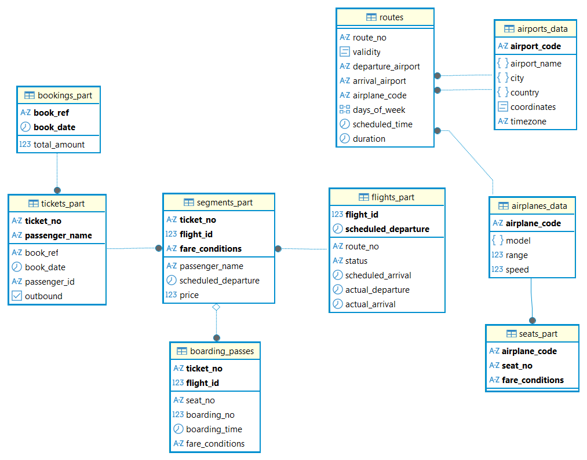

# Секционирование таблицы

## Цель

- научиться выполнять секционирование таблиц в PostgreSQL;
- повысить производительность запросов и упростив управление данными;

## План

1. Анализ структуры данных
2. Выбор таблицы для секционирования
3. Определение типа секционирования
4. Создание секционированной таблицы
5. Миграция данных
6. Оптимизация запросов
7. Тестирование решения
8. Документирование


## Структура таблиц

> [!NOTE]
> Для выполнения этого ДЗ пользуемся кластером в.17 в котором уже существует [демо-база от PostgresPro](https://postgrespro.ru/education/demodb). 
> База использовалась в рамках 9-го ДЗ.  

на заметку, структура схемы выглядит следующим образом: 


```sql
postgres@ubt-pg-aduron:~/demo$ psql -U postgres -d demo
psql (17.6 (Ubuntu 17.6-2.pgdg24.04+1))
Type "help" for help.

demo=# \d+
                                                             List of relations
  Schema  |         Name          |   Type   |  Owner   | Persistence | Access method |    Size    |              Description
----------+-----------------------+----------+----------+-------------+---------------+------------+----------------------------------------
 bookings | airplanes             | view     | postgres | permanent   |               | 0 bytes    | Airplanes
 bookings | airplanes_data        | table    | postgres | permanent   | heap          | 16 kB      | Airplanes (internal multilingual data)
 bookings | airports              | view     | postgres | permanent   |               | 0 bytes    | Airports
 bookings | airports_data         | table    | postgres | permanent   | heap          | 1280 kB    | Airports (internal multilingual data)
 bookings | boarding_passes       | table    | postgres | permanent   | heap          | 160 MB     | Boarding passes
 bookings | bookings              | table    | postgres | permanent   | heap          | 64 MB      | Bookings
 bookings | flights               | table    | postgres | permanent   | heap          | 1672 kB    | Flights
 bookings | flights_flight_id_seq | sequence | postgres | permanent   |               | 8192 bytes |
 bookings | routes                | table    | postgres | permanent   | heap          | 224 kB     | Routes
 bookings | seats                 | table    | postgres | permanent   | heap          | 120 kB     | Seats
 bookings | segments              | table    | postgres | permanent   | heap          | 257 MB     | Flight segment (leg)
 bookings | tickets               | table    | postgres | permanent   | heap          | 240 MB     | Tickets
 bookings | timetable             | view     | postgres | permanent   |               | 0 bytes    | Detailed info about flights
(13 rows)
```


## Выполнение

### 1. Анализ структуры данных

В целом, в рамках секционнирования по диапазону значений, мы расматриваем данные, для которых мы можем 
- заранее определить распределение и регулярность появления новых данных
- имеют тип данных, позволяющий определение диапазонов (например *date*)
- которые являются критерием отбора (partition pruning) в запросах 
- Которые меняются как можно реже (с целью минимизирровать меремешение между партициями) 

В таблице *bookings*, только столбец *book_date* соответствует этим критерям, как как:
- имеет тип *date*
- запросы по этой таблице (если не по PK) имеют больщую вуроятность включить дату бронирования (например: ежемесячные / ежегодные отчеты...), и соответсвенно выигрывать от серционирования. 

В таблице *flights*, можно секционировать по диапазону значений стольца *scheduled_departure*, который:
- тоже имеет тип данных *date*
- будет скорее всего включен в запросах типа "отчет количевства / итоговая сумма проданых билетов, рейсы которых состоятся между *date_1* и *date2*".


### 2. Выбор таблицы / 3. определение типа секционирования

В рамках этого ДЗ, выбираем для секционнирования следующих таблиц

1. *bookings* - секционировать по диапазону значений стольца *book_date*
2. *flights* - секционировать по диапазону значений стольца *scheduled_departure*
3. *segments* - Секционирование по списку значений стольца *fare_conditions*
4. *seats* - Секционирование по списку значений стольца *fare_conditions*
5. *tickets* - Секционирование по хэшу стольца *passenger_name*

О пунктах 1 и 2 уже говорили.
Касательно *segments* и *seats*, секционирование по *fare_conditions* мог бы играть в пользу выполнения запросов следующего типа:
- Процент занятости самолетов по категориям цен.
- Отчет проданных биллетов по категориям цен.
Секционирование таблицы *tickets* по хэшу стольца *passenger_name* мог бы улучшить производительность запросов, включвя критерии поиска по имени. 


### 4. Создание секционированной таблицы

#### Таблица bookings

> [!NOTE] 
> *book_date* добавлен в PK чтобы позволить секционирование по нему

```sql
-- bookings.bookings_part определение

-- DROP TABLE bookings.bookings_part;
CREATE TABLE bookings.bookings_part (
	book_ref bpchar(6) NOT NULL,
	book_date timestamptz NOT NULL,
	total_amount numeric(10, 2) NOT NULL,
	CONSTRAINT bookings_part_pkey PRIMARY KEY (book_ref, book_date)
)
PARTITION BY RANGE (book_date);

-- Permissions

ALTER TABLE bookings.bookings_part OWNER TO postgres;
GRANT ALL ON TABLE bookings.bookings_part TO postgres;
```

С целью узнать, какие секции нам нужны, запросим значения min и max:

```sql
select min(book_date), max(book_date) from bookings.bookings;

min                          |max                          |
-----------------------------+-----------------------------+
2025-09-01 03:00:06.265 +0300|2025-12-01 02:59:28.616 +0300|
```

Тут секционирование по месяцам означает всего лишь 4 секции, что маловато в рамках этого упражнения (но наверняка было бы лучше с точки зрения масштабирования)
Поэтому выбираем секционирование по дням. 

```sql
-- Partitions
-- 2025-09-01 03:00:06.265 +0300|2025-12-01 02:59:28.616 +0300|

CREATE TABLE bookings_part_20250901 PARTITION OF bookings_part FOR VALUES FROM ('2025-09-01'::timestamptz) TO ('2025-09-02'::timestamptz);
CREATE TABLE bookings_part_20250902 PARTITION OF bookings_part FOR VALUES FROM ('2025-09-02'::timestamptz) TO ('2025-09-03'::timestamptz);
CREATE TABLE bookings_part_20250903 PARTITION OF bookings_part FOR VALUES FROM ('2025-09-03'::timestamptz) TO ('2025-09-04'::timestamptz);
CREATE TABLE bookings_part_20250904 PARTITION OF bookings_part FOR VALUES FROM ('2025-09-04'::timestamptz) TO ('2025-09-05'::timestamptz);
CREATE TABLE bookings_part_20250905 PARTITION OF bookings_part FOR VALUES FROM ('2025-09-05'::timestamptz) TO ('2025-09-06'::timestamptz);
CREATE TABLE bookings_part_20250906 PARTITION OF bookings_part FOR VALUES FROM ('2025-09-06'::timestamptz) TO ('2025-09-07'::timestamptz);
CREATE TABLE bookings_part_20250907 PARTITION OF bookings_part FOR VALUES FROM ('2025-09-07'::timestamptz) TO ('2025-09-08'::timestamptz);
CREATE TABLE bookings_part_20250908 PARTITION OF bookings_part FOR VALUES FROM ('2025-09-08'::timestamptz) TO ('2025-09-09'::timestamptz);
CREATE TABLE bookings_part_20250909 PARTITION OF bookings_part FOR VALUES FROM ('2025-09-09'::timestamptz) TO ('2025-09-10'::timestamptz);
...
CREATE TABLE bookings_part_20251124 PARTITION OF bookings_part FOR VALUES FROM ('2025-11-24'::timestamptz) TO ('2025-11-25'::timestamptz);
CREATE TABLE bookings_part_20251125 PARTITION OF bookings_part FOR VALUES FROM ('2025-11-25'::timestamptz) TO ('2025-11-26'::timestamptz);
CREATE TABLE bookings_part_20251126 PARTITION OF bookings_part FOR VALUES FROM ('2025-11-26'::timestamptz) TO ('2025-11-27'::timestamptz);
CREATE TABLE bookings_part_20251127 PARTITION OF bookings_part FOR VALUES FROM ('2025-11-27'::timestamptz) TO ('2025-11-28'::timestamptz);
CREATE TABLE bookings_part_20251128 PARTITION OF bookings_part FOR VALUES FROM ('2025-11-28'::timestamptz) TO ('2025-11-29'::timestamptz);
CREATE TABLE bookings_part_20251129 PARTITION OF bookings_part FOR VALUES FROM ('2025-11-29'::timestamptz) TO ('2025-11-30'::timestamptz);
CREATE TABLE bookings_part_20251130 PARTITION OF bookings_part FOR VALUES FROM ('2025-11-30'::timestamptz) TO ('2025-12-01'::timestamptz);
CREATE TABLE bookings_part_20251201 PARTITION OF bookings_part FOR VALUES FROM ('2025-12-01'::timestamptz) TO ('2025-12-02'::timestamptz);
CREATE TABLE bookings_part_20251202 PARTITION OF bookings_part FOR VALUES FROM ('2025-12-02'::timestamptz) TO ('2025-12-03'::timestamptz);
CREATE TABLE bookings_part_default PARTITION OF bookings_part DEFAULT;
```

После секционирования, можно проверить присутствие нащих секций:
```sql
demo=# \d+ bookings_part
                                           Partitioned table "bookings.bookings_part"
    Column    |           Type           | Collation | Nullable | Default | Storage  | Compression | Stats target | Description
--------------+--------------------------+-----------+----------+---------+----------+-------------+--------------+-------------
 book_ref     | character(6)             |           | not null |         | extended |             |              |
 book_date    | timestamp with time zone |           | not null |         | plain    |             |              |
 total_amount | numeric(10,2)            |           | not null |         | main     |             |              |
Partition key: RANGE (book_date)
Indexes:
    "bookings_part_pkey" PRIMARY KEY, btree (book_ref, book_date)
Partitions: bookings_part_20250901 FOR VALUES FROM ('2025-08-31 21:00:00+00') TO ('2025-09-01 21:00:00+00'),
            bookings_part_20250902 FOR VALUES FROM ('2025-09-01 21:00:00+00') TO ('2025-09-02 21:00:00+00'),
            bookings_part_20250903 FOR VALUES FROM ('2025-09-02 21:00:00+00') TO ('2025-09-03 21:00:00+00'),
            bookings_part_20250904 FOR VALUES FROM ('2025-09-03 21:00:00+00') TO ('2025-09-04 21:00:00+00'),
            bookings_part_20250905 FOR VALUES FROM ('2025-09-04 21:00:00+00') TO ('2025-09-05 21:00:00+00'),
...
```


#### Таблица flights

> [!NOTE] 
> *scheduled_departure* добавлен в PK чтобы позволить секционирование по нему

Такое же изучение и схежу секционирования делаем для таблицы *flights*

```sql
-- bookings.flights_part определение

-- DROP TABLE bookings.flights_part;
CREATE TABLE bookings.flights_part (
	flight_id int4 GENERATED ALWAYS AS IDENTITY( INCREMENT BY 1 MINVALUE 1 MAXVALUE 2147483647 START 1 CACHE 1 NO CYCLE) NOT NULL,
	route_no text NOT NULL,
	status text NOT NULL,
	scheduled_departure timestamptz NOT NULL,
	scheduled_arrival timestamptz NOT NULL,
	actual_departure timestamptz NULL,
	actual_arrival timestamptz NULL,
	CONSTRAINT flights_part_actual_check CHECK (((actual_arrival IS NULL) OR ((actual_departure IS NOT NULL) AND (actual_arrival IS NOT NULL) AND (actual_arrival > actual_departure)))),
	CONSTRAINT flights_part_scheduled_check CHECK ((scheduled_arrival > scheduled_departure)),
	CONSTRAINT flights_part_status_check CHECK ((status = ANY (ARRAY['Scheduled'::text, 'On Time'::text, 'Delayed'::text, 'Boarding'::text, 'Departed'::text, 'Arrived'::text, 'Cancelled'::text]))),
	CONSTRAINT flights_part_pkey PRIMARY KEY (flight_id, scheduled_departure),
	CONSTRAINT flights_part_route_no_scheduled_departure_key UNIQUE (route_no, scheduled_departure)
) PARTITION BY RANGE(scheduled_departure);

CREATE INDEX flights_part_status_dep_arr ON bookings.flights_part USING btree (status, actual_departure, actual_arrival);

-- Permissions

ALTER TABLE bookings.flights_part OWNER TO postgres;
GRANT ALL ON TABLE bookings.flights_part TO postgres;
```

Создание секций
```sql
demo=# select min(scheduled_departure), max(scheduled_departure) from bookings.flights;
          min           |          max
------------------------+------------------------
 2025-10-01 00:00:00+00 | 2026-01-29 23:55:00+00
(1 row)
```

```sql
-- Table partitions

CREATE TABLE flights_part_20251001 PARTITION OF flights_part FOR VALUES FROM ('2025-10-01'::timestamptz) TO ('2025-10-02'::timestamptz);
CREATE TABLE flights_part_20251002 PARTITION OF flights_part FOR VALUES FROM ('2025-10-02'::timestamptz) TO ('2025-10-03'::timestamptz);
CREATE TABLE flights_part_20251003 PARTITION OF flights_part FOR VALUES FROM ('2025-10-03'::timestamptz) TO ('2025-10-04'::timestamptz);
...
CREATE TABLE flights_part_20260128 PARTITION OF flights_part FOR VALUES FROM ('2026-01-28'::timestamptz) TO ('2026-01-29'::timestamptz);
CREATE TABLE flights_part_20260129 PARTITION OF flights_part FOR VALUES FROM ('2026-01-29'::timestamptz) TO ('2026-01-30'::timestamptz);
CREATE TABLE flights_part_20260130 PARTITION OF flights_part FOR VALUES FROM ('2026-01-30'::timestamptz) TO ('2026-11-01'::timestamptz);
CREATE TABLE flights_part_default PARTITION OF flights_part DEFAULT;
```


#### Таблицы tickets


> [!NOTE] 
> Таблицу tickets приходится секционировать раньше segments, так как вторая включает FK на первую

> [!NOTE] 
> *passenger_name* добавлен в PK чтобы позволить секционирование по нему

> [!NOTE] 
> *book_date* добавлен для создания FK к BOOKINGS_PART

```sql
-- bookings.tickets_part определение

-- DROP TABLE bookings.tickets_part ;
CREATE TABLE bookings.tickets_part (
	ticket_no text NOT NULL,
	book_ref bpchar(6) NOT NULL,
	book_date timestamptz NOT NULL,
	passenger_id text NOT NULL,
	passenger_name text NOT NULL,
	outbound bool NOT NULL,
	CONSTRAINT tickets_part_book_ref_passenger_id_outbound_key UNIQUE (book_ref, passenger_id, outbound, passenger_name),
	CONSTRAINT tickets_part_pkey PRIMARY KEY (ticket_no, passenger_name)
) PARTITION BY HASH(passenger_name);
CREATE INDEX tickets_part_passenger_name ON bookings.tickets_part USING gin (passenger_name gin_trgm_ops);
CREATE INDEX tickets_part_passenger_uppername ON bookings.tickets_part USING btree (upper(passenger_name));

-- Permissions

ALTER TABLE bookings.tickets_part OWNER TO postgres;
GRANT ALL ON TABLE bookings.tickets_part TO postgres;

-- bookings.tickets_part внешние включи

ALTER TABLE bookings.tickets_part ADD CONSTRAINT tickets_part_book_ref_date_fkey FOREIGN KEY (book_ref, book_date) REFERENCES bookings.bookings_part(book_ref, book_date);

-- Table partitions
CREATE TABLE bookings.tickets_part_r0 PARTITION OF bookings.tickets_part FOR VALUES WITH (modulus 10, remainder 0);
CREATE TABLE bookings.tickets_part_r1 PARTITION OF bookings.tickets_part FOR VALUES WITH (modulus 10, remainder 1);
CREATE TABLE bookings.tickets_part_r2 PARTITION OF bookings.tickets_part FOR VALUES WITH (modulus 10, remainder 2);
CREATE TABLE bookings.tickets_part_r3 PARTITION OF bookings.tickets_part FOR VALUES WITH (modulus 10, remainder 3);
CREATE TABLE bookings.tickets_part_r4 PARTITION OF bookings.tickets_part FOR VALUES WITH (modulus 10, remainder 4);
CREATE TABLE bookings.tickets_part_r5 PARTITION OF bookings.tickets_part FOR VALUES WITH (modulus 10, remainder 5);
CREATE TABLE bookings.tickets_part_r6 PARTITION OF bookings.tickets_part FOR VALUES WITH (modulus 10, remainder 6);
CREATE TABLE bookings.tickets_part_r7 PARTITION OF bookings.tickets_part FOR VALUES WITH (modulus 10, remainder 7);
CREATE TABLE bookings.tickets_part_r8 PARTITION OF bookings.tickets_part FOR VALUES WITH (modulus 10, remainder 8);
CREATE TABLE bookings.tickets_part_r9 PARTITION OF bookings.tickets_part FOR VALUES WITH (modulus 10, remainder 9);
```


#### Таблицы segments и seats

> [!NOTE] 
> *fare_conditions* добавлен в PK обоих таблиц чтобы позволить секционирование

> [!NOTE] 
> *passenger_name* добавлен для создания FK к TICKETS_PART
> *scheduled_departure* добавлен для создания FK к FLIGHTS_PART

```sql
-- bookings.segments_part определение

-- DROP TABLE bookings.segments_part ;
CREATE TABLE bookings.segments_part (
	ticket_no text NOT NULL,
		passenger_name text NOT NULL, -- added to reference table TICKETS_PART
	flight_id int4 NOT NULL,
		scheduled_departure timestamptz NOT NULL, -- added to reference table FLIGHTS_PART
	fare_conditions text NOT NULL,
	price numeric(10, 2) NOT NULL,
	CONSTRAINT segments_part_fare_conditions_check CHECK ((fare_conditions = ANY (ARRAY['Economy'::text, 'Comfort'::text, 'Business'::text]))),
	CONSTRAINT segments_part_pkey PRIMARY KEY (ticket_no, flight_id, fare_conditions),
	CONSTRAINT segments_part_price_check CHECK ((price >= (0)::numeric))
) PARTITION BY LIST (fare_conditions);

CREATE INDEX segments_part_flight_id_idx ON bookings.segments_part USING btree (flight_id);

-- Permissions

ALTER TABLE bookings.segments_part OWNER TO postgres;
GRANT ALL ON TABLE bookings.segments_part TO postgres;

-- Partitions

CREATE TABLE bookings.segments_part_bsn PARTITION OF bookings.segments_part FOR VALUES IN ('Business');
CREATE TABLE bookings.segments_part_cmf PARTITION OF bookings.segments_part FOR VALUES IN ('Comfort');
CREATE TABLE bookings.segments_part_eco PARTITION OF bookings.segments_part FOR VALUES IN ('Economy');

-- Foreign Keys

ALTER TABLE bookings.segments_part ADD CONSTRAINT segments_part_flight_part_fkey FOREIGN KEY (flight_id,scheduled_departure) REFERENCES bookings.flights_part(flight_id,scheduled_departure);
ALTER TABLE bookings.segments_part ADD CONSTRAINT segments_part_ticket_no_fkey FOREIGN KEY (ticket_no,passenger_name) REFERENCES bookings.tickets_part(ticket_no,passenger_name);
```


```sql
-- bookings.seats_part определение

-- DROP TABLE bookings.seats_part;
CREATE TABLE bookings.seats_part (
	airplane_code bpchar(3) NOT NULL,
	seat_no text NOT NULL,
	fare_conditions text NOT NULL,
	CONSTRAINT seats_part_fare_conditions_check CHECK ((fare_conditions = ANY (ARRAY['Economy'::text, 'Comfort'::text, 'Business'::text]))),
	CONSTRAINT seats_part_pkey PRIMARY KEY (airplane_code, seat_no, fare_conditions)
) PARTITION BY LIST (fare_conditions);

-- Permissions

ALTER TABLE bookings.seats_part OWNER TO postgres;
GRANT ALL ON TABLE bookings.seats_part TO postgres;

-- Partitions

CREATE TABLE bookings.seats_part_bsn PARTITION OF bookings.seats_part FOR VALUES IN ('Business');
CREATE TABLE bookings.seats_part_cmf PARTITION OF bookings.seats_part FOR VALUES IN ('Comfort');
CREATE TABLE bookings.seats_part_eco PARTITION OF bookings.seats_part FOR VALUES IN ('Economy');

-- bookings.seats внешние включи

ALTER TABLE bookings.seats_part ADD CONSTRAINT seats_part_airplane_code_fkey FOREIGN KEY (airplane_code) REFERENCES bookings.airplanes_data(airplane_code) ON DELETE CASCADE;
```


### 5. Миграция данных

Тут просто выполняем *Insert As Select*, однако приходится
- не забывать включить SET TIME ZONE для проверки совпадения данных типа *timestamptz*
- Пользоваться *OVERRIDING SYSTEM VALUE* для *flights_part* из за присутствия столбца типа *GENERATED ALWAYS*
- Создать джойн для получения данных из других таблиц, когда присутствует новый столбец (это касается *tickets_part* и *segments_part*)


#### Таблица *bookings* -> *bookings_part*

```sql
demo=# insert into bookings.bookings_part
demo-# select * from bookings.bookings;
INSERT 0 1292893

demo=# select count(*) from bookings.bookings_part_20251121; -- 2025-11-21 00:00:00.000 +0300|13800|
 count
-------
 13800
(1 row)

demo=# select count(*) from bookings.bookings_part_20251011; -- 2025-10-11 00:00:00.000 +0300|14175|
 count
-------
 14175
(1 row)
```

```sql
demo=# show time zone
demo-# ;
 TimeZone
----------
 Etc/UTC
(1 row)

demo=# select * from bookings.bookings_part_20251121 limit 1;
 book_ref |           book_date           | total_amount
----------+-------------------------------+--------------
 YP2WI8   | 2025-11-21 00:28:20.144622+03 |     12000.00
(1 row)

demo=# SET TIME ZONE '+3';
SET
```

```sql
demo=# select * from bookings.bookings_part_20251121
except
select * from bookings.bookings where DATE_TRUNC('day',book_date)= '2025-11-21'::timestamptz;
 book_ref | book_date | total_amount
----------+-----------+--------------
(0 rows)
```


#### Таблица *seats* -> *seats_part*


```sql
demo=# insert into bookings.seats_part select * from bookings.seats;
INSERT 0 1741
```


#### Таблица *flights* -> *flights_part*

```sql
demo=# insert into bookings.flights_part select * from bookings.flights;
ERROR:  cannot insert a non-DEFAULT value into column "flight_id"
DETAIL:  Column "flight_id" is an identity column defined as GENERATED ALWAYS.
HINT:  Use OVERRIDING SYSTEM VALUE to override.

demo=# insert into bookings.flights_part
demo-# OVERRIDING SYSTEM VALUE
demo-# select * from bookings.flights;
INSERT 0 21758
```


#### Таблица *tickets* + *bookings(book_date)* -> *tickets_part*


```sql
demo=# begin;
BEGIN
demo=*# insert into bookings.tickets_part (ticket_no, book_ref, book_date, passenger_id, passenger_name, outbound)
select
      t.ticket_no, t.book_ref, b.book_date, t.passenger_id, t.passenger_name,   t.outbound
from bookings.tickets t, bookings.BOOKINGS b
where t.book_ref = b.book_ref;
INSERT 0 2973937
demo=*# select count(*) from bookings.tickets;
  count
---------
 2973937
(1 row)
demo=*# commit;
COMMIT
```

#### Таблица *segments* + *tickets(passenger_name)* + *flights(scheduled_departure)* -> *segments_part*


```sql
demo=# begin;
BEGIN
demo=*# insert into bookings.segments_part (
      ticket_no,
        passenger_name, -- added to reference table TICKETS_PART
        flight_id,
        scheduled_departure, -- added to reference table FLIGHTS_PART
        fare_conditions,
        price)
select
      s.ticket_no,
        t.passenger_name,
        s.flight_id,
        f.scheduled_departure,
        s.fare_conditions,
        s.price
from bookings.segments s, bookings.tickets t, bookings.flights f
where s.ticket_no = t.ticket_no and s.flight_id = f.flight_id;
INSERT 0 3941249
demo=*# select count(*) from bookings.segments;
  count
---------
 3941249
(1 row)

demo=*# select * from bookings.segments_part limit 2;
   ticket_no   | passenger_name | flight_id |  scheduled_departure   | fare_conditions |  price
---------------+----------------+-----------+------------------------+-----------------+----------
 0005432000251 | Xing Liu       |      2233 | 2025-10-13 13:15:00+03 | Business        | 12500.00
 0005432000449 | Shanti Maiiti  |       335 | 2025-10-02 23:50:00+03 | Business        |  9000.00
(2 rows)

demo=*# commit;
COMMIT
```


### 6. Оптимизация запросов

```sql
demo=# explain analyze
demo-# select * from bookings.bookings where  book_date between '2025-11-21 10:00:00+03' and '2025-11-21 11:00:00+03';
                                                                        QUERY PLAN
-----------------------------------------------------------------------------------------------------------------------------------------------------------
 Gather  (cost=1000.00..17375.98 rows=554 width=21) (actual time=83.266..85.739 rows=582 loops=1)
   Workers Planned: 2
   Workers Launched: 2
   ->  Parallel Seq Scan on bookings  (cost=0.00..16320.58 rows=231 width=21) (actual time=64.246..69.478 rows=194 loops=3)
         Filter: ((book_date >= '2025-11-21 10:00:00+03'::timestamp with time zone) AND (book_date <= '2025-11-21 11:00:00+03'::timestamp with time zone))
         Rows Removed by Filter: 430770
 Planning Time: 0.250 ms
 Execution Time: 85.792 ms
(8 rows)

demo-# select * from bookings.bookings_part where book_date between '2025-11-21 10:00:00+03' and '2025-11-21 11:00:00+03';
                                                                     QUERY PLAN
-----------------------------------------------------------------------------------------------------------------------------------------------------
 Seq Scan on bookings_part_20251121 bookings_part  (cost=0.00..295.00 rows=578 width=21) (actual time=0.586..2.081 rows=582 loops=1)
   Filter: ((book_date >= '2025-11-21 10:00:00+03'::timestamp with time zone) AND (book_date <= '2025-11-21 11:00:00+03'::timestamp with time zone))
   Rows Removed by Filter: 13218
 Planning Time: 0.469 ms
 Execution Time: 2.147 ms
(5 rows)
```

```sql
demo=# explain analyze
demo-# select * from bookings.bookings where book_date between '2025-11-21 10:00:00+03' and '2025-11-25 11:00:00+03';
                                                                        QUERY PLAN
-----------------------------------------------------------------------------------------------------------------------------------------------------------
 Gather  (cost=1000.00..22762.88 rows=54423 width=21) (actual time=72.614..91.013 rows=54454 loops=1)
   Workers Planned: 2
   Workers Launched: 2
   ->  Parallel Seq Scan on bookings  (cost=0.00..16320.58 rows=22676 width=21) (actual time=63.735..70.526 rows=18151 loops=3)
         Filter: ((book_date >= '2025-11-21 10:00:00+03'::timestamp with time zone) AND (book_date <= '2025-11-25 11:00:00+03'::timestamp with time zone))
         Rows Removed by Filter: 412813
 Planning Time: 0.132 ms
 Execution Time: 94.211 ms
(8 rows)

select * from bookings.bookings_part where book_date between '2025-11-21 10:00:00+03' and '2025-11-25 11:00:00+03';
demo=# explain analyze
demo-# select * from bookings.bookings_part where book_date between '2025-11-21 10:00:00+03' and '2025-11-25 11:00:00+03';
                                                                        QUERY PLAN
-----------------------------------------------------------------------------------------------------------------------------------------------------------
 Append  (cost=0.00..1716.19 rows=54443 width=21) (actual time=0.550..23.214 rows=54454 loops=1)
   ->  Seq Scan on bookings_part_20251121 bookings_part_1  (cost=0.00..295.00 rows=8113 width=21) (actual time=0.549..2.752 rows=8116 loops=1)
         Filter: ((book_date >= '2025-11-21 10:00:00+03'::timestamp with time zone) AND (book_date <= '2025-11-25 11:00:00+03'::timestamp with time zone))
         Rows Removed by Filter: 5684
   ->  Seq Scan on bookings_part_20251122 bookings_part_2  (cost=0.00..293.35 rows=13687 width=21) (actual time=0.029..3.417 rows=13690 loops=1)
         Filter: ((book_date >= '2025-11-21 10:00:00+03'::timestamp with time zone) AND (book_date <= '2025-11-25 11:00:00+03'::timestamp with time zone))
   ->  Seq Scan on bookings_part_20251123 bookings_part_3  (cost=0.00..287.67 rows=13442 width=21) (actual time=0.013..2.356 rows=13445 loops=1)
         Filter: ((book_date >= '2025-11-21 10:00:00+03'::timestamp with time zone) AND (book_date <= '2025-11-25 11:00:00+03'::timestamp with time zone))
   ->  Seq Scan on bookings_part_20251124 bookings_part_4  (cost=0.00..283.94 rows=13260 width=21) (actual time=0.009..4.395 rows=13263 loops=1)
         Filter: ((book_date >= '2025-11-21 10:00:00+03'::timestamp with time zone) AND (book_date <= '2025-11-25 11:00:00+03'::timestamp with time zone))
   ->  Seq Scan on bookings_part_20251125 bookings_part_5  (cost=0.00..284.00 rows=5941 width=21) (actual time=0.015..1.372 rows=5940 loops=1)
         Filter: ((book_date >= '2025-11-21 10:00:00+03'::timestamp with time zone) AND (book_date <= '2025-11-25 11:00:00+03'::timestamp with time zone))
         Rows Removed by Filter: 7327
 Planning Time: 0.605 ms
 Execution Time: 28.260 ms
(15 rows)
```


### 7. Тестирование решения

Добавление данных:
```sql
demo=# SET TIME ZONE '+3';
SET
demo=# insert into bookings_part
values ('AAAAAA', '2025-11-21 03:03:03.333333+03', 3333.33);
INSERT 0 1
demo=# select * from bookings.bookings_part_20251121
except
select * from bookings.bookings where DATE_TRUNC('day',book_date)= '2025-11-21'::timestamptz;
 book_ref |           book_date           | total_amount
----------+-------------------------------+--------------
 AAAAAA   | 2025-11-21 03:03:03.333333+03 |      3333.33
(1 row)
```

Проверяем добавление данных в секции по умолчанию:
```sql
demo=# insert into bookings_part
values ('BBBBBB', '2026-01-15 00:00:00.000000+03', 12345.67);
INSERT 0 1
demo=# select * from bookings_part_default;
 book_ref |       book_date        | total_amount
----------+------------------------+--------------
 BBBBBB   | 2026-01-15 00:00:00+03 |     12345.67
(1 row)
```

Проверяем, что при изменении данных, записи перемешаются в нужную секцию:
```sql
demo=# update bookings_part set book_date = '2025-11-21 03:03:03.333333+03'
where book_ref = 'BBBBBB';
UPDATE 1
demo=# select * from bookings_part_default;
 book_ref | book_date | total_amount
----------+-----------+--------------
(0 rows)

demo=# select * from bookings.bookings_part_20251121
except
select * from bookings.bookings where DATE_TRUNC('day',book_date)= '2025-11-21'::timestamptz;
 book_ref |           book_date           | total_amount
----------+-------------------------------+--------------
 AAAAAA   | 2025-11-21 03:03:03.333333+03 |      3333.33
 BBBBBB   | 2025-11-21 03:03:03.333333+03 |     12345.67
(2 rows)
```

Простите, меня ждёт шампанское )


### 8. Документирование

Нужно не забывать пересоздать дополнитнльные FK, которые отсутсвуют после секционирования. В данном случае это касается *fare_conditions*

```sql
demo=# ALTER TABLE bookings.boarding_passes ADD COLUMN fare_conditions text;
ALTER TABLE

demo=# update bookings.boarding_passes b
set fare_conditions = sub.fare_conditions
from (
    select fare_conditions, ticket_no, flight_id
    from segments
) as sub
where
b.ticket_no = sub.ticket_no and
b.flight_id = sub.flight_id;
UPDATE 2463832

demo=# select * from bookings.boarding_passes limit 2;
   ticket_no   | flight_id | seat_no | boarding_no | boarding_time | fare_conditions
---------------+-----------+---------+-------------+---------------+-----------------
 0005433270216 |     11155 | 20E     |             |               | Economy
 0005433388594 |     11148 | 32B     |             |               | Economy
(2 rows)

demo=# ALTER TABLE bookings.boarding_passes
        ADD CONSTRAINT boarding_passes_tickets_part_no_flight_id_fkey
        FOREIGN KEY (ticket_no, flight_id, fare_conditions) REFERENCES segments_part(ticket_no, flight_id, fare_conditions);
ALTER TABLE

demo=# ALTER TABLE bookings.boarding_passes ADD CONSTRAINT chk_fare_conditions_nn CHECK (fare_conditions IS NOT NULL);
ALTER TABLE
```

В итоге, итоговая схема нашей секционированной demo-базы выглядит вот таким образом:



> [!NOTE] 
> Несмотря на то, что на оригинальной схеме показывается иначе, тут замечается, что FK между таблицами *routes* и *flights* (либо *flighs_part* после секционирования) отсутствует.


## Ресурсы 

1. [PostgresPro Demo DB](https://postgrespro.ru/education/demodb)
