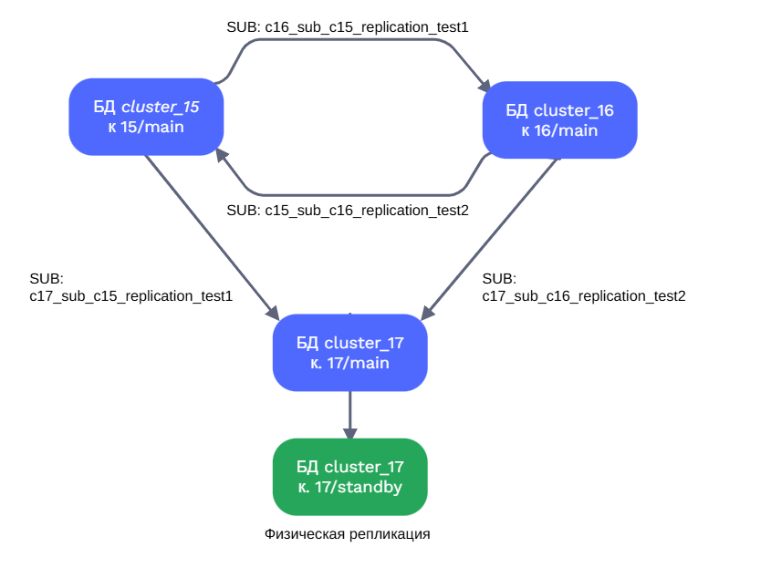

# Репликация

## Цель

- реализовать свой миникластер на трех виртуальных машинах

## План

1. Настройте ВМ1:

Создайте таблицу test, которая будет для операций записи
Создайте таблицу test2, которая будет для чтения
Настройте публикацию таблицы test

2. Настройте ВМ2:

Создайте таблицу test2, которая будет для операций записи
Создайте таблицу test, которая будет для чтения
Настройте публикацию таблицы test2
Сделайте подписку таблицы test на публикацию таблицы test с ВМ1

3. на ВМ1:

Сделайте подписку таблицы test2 на публикацию таблицы test2 с ВМ2

4. Настройте ВМ3:

Создайте таблицы: test и test2
Подпишите test на публикацию таблицы test с ВМ1
Подпишите test2 на публикацию таблицы test2 с ВМ2
Используйте этот узел для чтения объединённых данных и резервного копирования

5. Проверьте работу системы:

Выполните вставку в test на ВМ1 — убедитесь, что данные появились в test на ВМ2 и ВМ3
Выполните вставку в test2 на ВМ2 — убедитесь, что данные появились в test2 на ВМ1 и ВМ3

Задание повышенной сложности(*):

Настройте физическую репликацию с ВМ4, используя ВМ3 в качестве источника.


## Схема

> [!NOTE]
> Поскольку моя конфигурация не позволяет запустить такое количество ВМ, работа будет выполнена в разных кластерах:
> - 3 кластера разных версией кастально логической репликации (1, 2, 3)
> - 4-йй кластер такой же версии, как кластер 3

```
postgres@ubt-pg-aduron:~$ pg_lsclusters
Ver Cluster Port Status Owner    Data directory              Log file
14  main    5434 online postgres /var/lib/postgresql/14/main /var/log/postgresql/postgresql-14-main.log << кластер не использован>
15  main    5433 online postgres /mnt/data/15/main           /var/log/postgresql/postgresql-15-main.log
16  main    5435 online postgres /var/lib/postgresql/16/main /var/log/postgresql/postgresql-16-main.log
17  main    5432 online postgres /var/lib/postgresql/17/main /var/log/postgresql/postgresql-17-main.log
```

В итоге получим такую архитектуру:


## Выполнение

### 1. Настройте Кластер 1

> [!NOTE]
> Ползуемся здесь кластером в.15

```
postgres@ubt-pg-aduron:~$ psql -p 5433
psql (17.6 (Ubuntu 17.6-2.pgdg24.04+1), server 15.14 (Ubuntu 15.14-1.pgdg24.04+1))
Type "help" for help.

postgres=# alter system set wal_level=logical;
ALTER SYSTEM
postgres=# ALTER USER postgres WITH PASSWORD 'postgres';
ALTER ROLE
postgres=# CREATE DATABASE cluster_15 WITH OWNER = postgres;
CREATE DATABASE
```

Поскольку мы меняли *wal_level* нам стоит перезапустить кластер:
```
aduron@ubt-pg-aduron:~$ sudo systemctl restart postgresql@15-main
[sudo] password for aduron:
```

Проверка изменении 
```
postgres@ubt-pg-aduron:~$ psql -p 5433 -d cluster_15
psql (17.6 (Ubuntu 17.6-2.pgdg24.04+1), server 15.14 (Ubuntu 15.14-1.pgdg24.04+1))
Type "help" for help.

cluster_15=# show wal_level
;
 wal_level
-----------
 logical
(1 row)
```

Создадим схему *replication* и таблтицы *test1, test2*
```sql
cluster_15=# create schema replication;
CREATE SCHEMA
cluster_15=# create table replication.test1 (id integer, value text);
CREATE TABLE
cluster_15=# create table replication.test2 (id integer, value text);
CREATE TABLE
```

Создадим публикацию таблицы *test1*
```sql
cluster_15=# CREATE PUBLICATION c15_replication_test1 FOR TABLE replication.test1;
CREATE PUBLICATION

cluster_15=# \dRp+
                     Publication c15_replication_test1
  Owner   | All tables | Inserts | Updates | Deletes | Truncates | Via root
----------+------------+---------+---------+---------+-----------+----------
 postgres | f          | t       | t       | t       | t         | f
Tables:
    "replication.test1"
```

Проверим внешнее подключение к БД *cluster_15*
```
postgres@ubt-pg-aduron:~$  psql -h 192.168.56.10 -U postgres -p 5433 -d cluster_15
Password for user postgres:
psql (17.6 (Ubuntu 17.6-2.pgdg24.04+1), server 15.14 (Ubuntu 15.14-1.pgdg24.04+1))
SSL connection (protocol: TLSv1.3, cipher: TLS_AES_256_GCM_SHA384, compression: off, ALPN: none)
Type "help" for help.
```


### 2. Настройте Кластер 2

> [!NOTE]
> Ползуемся здесь кластером в.16

Здесь примерно также касательно создания базы под названием *cluster_16*
```sql
postgres@ubt-pg-aduron:~$ psql -p 5435
psql (17.6 (Ubuntu 17.6-2.pgdg24.04+1), server 16.11 (Ubuntu 16.11-1.pgdg24.04+1))
Type "help" for help.

postgres=# alter system set wal_level=logical;
ALTER SYSTEM
postgres=# ALTER USER postgres WITH PASSWORD 'postgres';
ALTER ROLE
postgres=# CREATE DATABASE cluster_16 WITH OWNER = postgres;
CREATE DATABASE
```

Перезапуск 
```sh
aduron@ubt-pg-aduron:~$ sudo systemctl restart postgresql@16-main
```

Проверяем настройки и добавляем схему с таблицами
```sql
postgres@ubt-pg-aduron:~$ psql -p 5435 -d cluster_16
psql (17.6 (Ubuntu 17.6-2.pgdg24.04+1), server 16.11 (Ubuntu 16.11-1.pgdg24.04+1))
Type "help" for help.

postgres=# show wal_level
;
 wal_level
-----------
 logical
(1 row)

cluster_16=# create schema replication;
CREATE SCHEMA
cluster_16=# create table replication.test1 (id integer, value text);
CREATE TABLE
cluster_16=# create table replication.test2 (id integer, value text);
CREATE TABLE
```

Создадим публикацию
```sql
cluster_16=# CREATE PUBLICATION c16_replication_test2 FOR TABLE replication.test2;
CREATE PUBLICATION

cluster_16=# \dRp+
                     Publication c16_replication_test2
  Owner   | All tables | Inserts | Updates | Deletes | Truncates | Via root
----------+------------+---------+---------+---------+-----------+----------
 postgres | f          | t       | t       | t       | t         | f
Tables:
    "replication.test2"
```

Проверяем внешнее подключение к *cluster_16*
```
postgres@ubt-pg-aduron:~$  psql -h 192.168.56.10 -U postgres -p 5435 -d cluster_16
Password for user postgres:
psql (17.6 (Ubuntu 17.6-2.pgdg24.04+1), server 16.11 (Ubuntu 16.11-1.pgdg24.04+1))
SSL connection (protocol: TLSv1.3, cipher: TLS_AES_256_GCM_SHA384, compression: off, ALPN: none)
Type "help" for help.
```

Создадим подписку на кластере в.16 к публикации *test1 (cluster_15)* 

```sql
cluster_16=# CREATE SUBSCRIPTION c16_sub_c15_replication_test1
CONNECTION 'host=192.168.56.10 port=5433 user=postgres password=postgres dbname=cluster_15'
PUBLICATION c15_replication_test1 WITH (copy_data = false);
NOTICE:  created replication slot "c16_sub_c15_replication_test1" on publisher
CREATE SUBSCRIPTION
cluster_16=# \dRs
                            List of subscriptions
             Name              |  Owner   | Enabled |       Publication
-------------------------------+----------+---------+-------------------------
 c16_sub_c15_replication_test1 | postgres | t       | {c15_replication_test1}
(1 row)

cluster_16=# SELECT * FROM pg_stat_subscription \gx
-[ RECORD 1 ]---------+------------------------------
subid                 | 16430
subname               | c16_sub_c15_replication_test1
pid                   | 2324
leader_pid            |
relid                 |
received_lsn          | 1/9276B2A8
last_msg_send_time    | 2025-12-21 08:15:17.931439+00
last_msg_receipt_time | 2025-12-21 08:15:17.931622+00
latest_end_lsn        | 1/9276B2A8
latest_end_time       | 2025-12-21 08:15:17.931439+00
```


### 3. на ВМ1 - Сделайте подписку таблицы test2 на публикацию таблицы test2 с ВМ2


Создадим подписку на кластере в.15 к публикации *test2 (cluster_16)* 

```sql
postgres@ubt-pg-aduron:~$  psql -h 192.168.56.10 -U postgres -p 5433 -d cluster_15
Password for user postgres:
psql (17.6 (Ubuntu 17.6-2.pgdg24.04+1), server 15.14 (Ubuntu 15.14-1.pgdg24.04+1))
SSL connection (protocol: TLSv1.3, cipher: TLS_AES_256_GCM_SHA384, compression: off, ALPN: none)
Type "help" for help.

cluster_15=# CREATE SUBSCRIPTION c15_sub_c16_replication_test2
CONNECTION 'host=192.168.56.10 port=5435 user=postgres password=postgres dbname=cluster_16'
PUBLICATION c16_replication_test2 WITH (copy_data = false);
NOTICE:  created replication slot "c15_sub_c16_replication_test2" on publisher
CREATE SUBSCRIPTION
cluster_15=# \dRs
                            List of subscriptions
             Name              |  Owner   | Enabled |       Publication
-------------------------------+----------+---------+-------------------------
 c15_sub_c16_replication_test2 | postgres | t       | {c16_replication_test2}
(1 row)

cluster_15=# SELECT * FROM pg_stat_subscription \gx
-[ RECORD 1 ]---------+------------------------------
subid                 | 16557
subname               | c15_sub_c16_replication_test2
pid                   | 2385
relid                 |
received_lsn          | 0/2253FC0
last_msg_send_time    | 2025-12-21 08:17:07.983686+00
last_msg_receipt_time | 2025-12-21 08:17:07.983878+00
latest_end_lsn        | 0/2253FC0
latest_end_time       | 2025-12-21 08:17:07.983686+00
```


### 4. Настройте ВМ3

> [!NOTE]
> Ползуемся здесь кластером в.17. 

Здесь примерно также касательно создания базы под названием *cluster_17*, однако оставим значение *wal_level=replica* для дальнейшей физической репликации.
```sql
postgres@ubt-pg-aduron:~$ psql -p 5432
psql (17.6 (Ubuntu 17.6-2.pgdg24.04+1))
Type "help" for help.

postgres=# show wal_level
postgres-# ;
 wal_level
-----------
 replica
(1 row)

postgres=# ALTER USER postgres WITH PASSWORD 'postgres';
ALTER ROLE
postgres=# CREATE DATABASE cluster_17 WITH OWNER = postgres;
CREATE DATABASE
```

Проверяем подключение к БД *cluster_17* и создадим схему
```sql
aduron@ubt-pg-aduron:~$ psql -h 192.168.56.10 -U postgres -p 5432 -d cluster_17
Password for user postgres:
psql (17.6 (Ubuntu 17.6-2.pgdg24.04+1))
SSL connection (protocol: TLSv1.3, cipher: TLS_AES_256_GCM_SHA384, compression: off, ALPN: postgresql)
Type "help" for help.

cluster_17=# create schema replication;
CREATE SCHEMA
cluster_17=# create table replication.test1 (id integer, value text);
CREATE TABLE
cluster_17=# create table replication.test2 (id integer, value text);
CREATE TABLE
```


Создадим подписки к *cluster_15* и *cluster_16*
```sql
aduron@ubt-pg-aduron:~$ psql -h 192.168.56.10 -U postgres -p 5432 -d cluster_17
Password for user postgres:
psql (17.6 (Ubuntu 17.6-2.pgdg24.04+1))
SSL connection (protocol: TLSv1.3, cipher: TLS_AES_256_GCM_SHA384, compression: off, ALPN: postgresql)
Type "help" for help.

cluster_17=# CREATE SUBSCRIPTION c17_sub_c15_replication_test1
CONNECTION 'host=192.168.56.10 port=5433 user=postgres password=postgres dbname=cluster_15'
PUBLICATION c15_replication_test1 WITH (copy_data = false);
NOTICE:  created replication slot "c17_sub_c15_replication_test1" on publisher
CREATE SUBSCRIPTION

cluster_17=# CREATE SUBSCRIPTION c17_sub_c16_replication_test2
CONNECTION 'host=192.168.56.10 port=5435 user=postgres password=postgres dbname=cluster_16'
PUBLICATION c16_replication_test2 WITH (copy_data = false);
NOTICE:  created replication slot "c17_sub_c16_replication_test2" on publisher
CREATE SUBSCRIPTION

cluster_17=# \dRs
                            List of subscriptions
             Name              |  Owner   | Enabled |       Publication
-------------------------------+----------+---------+-------------------------
 c17_sub_c15_replication_test1 | postgres | t       | {c15_replication_test1}
 c17_sub_c16_replication_test2 | postgres | t       | {c16_replication_test2}
(2 rows)
```


### 5. Проверьте работу системы

Ставим данные в test1 на *cluster_15* — убедимся, что данные появились в *test1* на *cluster_16* и *cluster_17*

```sql
cluster_15=# insert into replication.test1
select
        generate_series(1,100) AS id,
        md5(random()::text) AS value
;
INSERT 0 100

cluster_15=# select count(*) from replication.test1;
 count
-------
   100
(1 row)

cluster_15=# select * from replication.test1 limit 1;
 id |              value
----+----------------------------------
  1 | 4329146edfbc5601ba82342f480d40dd
(1 row)
```

_cluster_17_
```sql
cluster_17=# select count(*) from replication.test1;
 count
-------
   100
(1 row)

cluster_17=#  select * from replication.test1 limit 1;
 id |              value
----+----------------------------------
  1 | 4329146edfbc5601ba82342f480d40dd
(1 row)
```

_cluster_16_
```sql
cluster_16=# select count(*) from replication.test1;
 count
-------
   100
(1 row)

cluster_16=# select * from replication.test1 limit 1;
 id |              value
----+----------------------------------
  1 | 4329146edfbc5601ba82342f480d40dd
(1 row)
```

Ставим данные в test2 на *cluster_16* — убедимся, что данные появились в *test2* на *cluster_15* и *cluster_17*

```sql
cluster_16=# insert into replication.test2
select
        generate_series(1,300) AS id,
        md5(random()::text) AS value
;
INSERT 0 300

cluster_16=# select * from replication.test2 where id in (1,3,5,7,9);
 id |              value
----+----------------------------------
  1 | 2e08c348c38abbfc6c4866cd4e9e77b0
  3 | 813e10b23eb016e44e1c3f56aff260bb
  5 | fc5c6f05933caec6e6bc978642f854b0
  7 | 057c42876a0ad958321695727217bb67
  9 | 66c01cbf2a4b5f503756fecb255ee920
(5 rows)
```

_cluster_17_
```sql
cluster_17=# select * from replication.test2 where id in (1,3,5,7,9);
 id |              value
----+----------------------------------
  1 | 2e08c348c38abbfc6c4866cd4e9e77b0
  3 | 813e10b23eb016e44e1c3f56aff260bb
  5 | fc5c6f05933caec6e6bc978642f854b0
  7 | 057c42876a0ad958321695727217bb67
  9 | 66c01cbf2a4b5f503756fecb255ee920
(5 rows)
```

_cluster_15_
```sql
cluster_15=# select * from replication.test2 where id in (1,3,5,7,9);
 id |              value
----+----------------------------------
  1 | 2e08c348c38abbfc6c4866cd4e9e77b0
  3 | 813e10b23eb016e44e1c3f56aff260bb
  5 | fc5c6f05933caec6e6bc978642f854b0
  7 | 057c42876a0ad958321695727217bb67
  9 | 66c01cbf2a4b5f503756fecb255ee920
(5 rows)
```


### Задание со *

Создадим новый кластер в.17 под названием *standby*, которого будем исползовать для физической репликации.

```sql
aduron@ubt-pg-aduron:~$ sudo pg_createcluster 17 standby
[sudo] password for aduron:
Creating new PostgreSQL cluster 17/standby ...
/usr/lib/postgresql/17/bin/initdb -D /var/lib/postgresql/17/standby --auth-local peer --auth-host scram-sha-256 --no-instructions
The files belonging to this database system will be owned by user "postgres".
This user must also own the server process.

The database cluster will be initialized with locale "en_US.UTF-8".
The default database encoding has accordingly been set to "UTF8".
The default text search configuration will be set to "english".

Data page checksums are disabled.

fixing permissions on existing directory /var/lib/postgresql/17/standby ... ok
creating subdirectories ... ok
selecting dynamic shared memory implementation ... posix
selecting default "max_connections" ... 100
selecting default "shared_buffers" ... 128MB
selecting default time zone ... Etc/UTC
creating configuration files ... ok
running bootstrap script ... ok
performing post-bootstrap initialization ... ok
syncing data to disk ... ok
Ver Cluster Port Status Owner    Data directory                 Log file
17  standby 5436 down   postgres /var/lib/postgresql/17/standby /var/log/postgresql/postgresql-17-standby.log
```

Настраиваем физическую репликацию с класером *17/standby*, используя *17/main* в качестве источника.
Добавляем стоку в /etc/postgresql/17/standby/pg_hba.conf
```sh
host    all             postgres        192.168.56.10/24        scram-sha-256
```

В postgresql.conf довавим *listen_addresses*
```sh
listen_addresses = 'localhost,192.168.56.10'
```

Удаляем каталог стендбая
```sh
aduron@ubt-pg-aduron:~$ sudo rm -rf /var/lib/postgresql/17/standby
aduron@ubt-pg-aduron:~$ sudo pg_lsclusters
Ver Cluster Port Status Owner     Data directory                 Log file
14  main    5434 online postgres  /var/lib/postgresql/14/main    /var/log/postgresql/postgresql-14-main.log
15  main    5433 online postgres  /mnt/data/15/main              /var/log/postgresql/postgresql-15-main.log
16  main    5435 online postgres  /var/lib/postgresql/16/main    /var/log/postgresql/postgresql-16-main.log
17  main    5432 online postgres  /var/lib/postgresql/17/main    /var/log/postgresql/postgresql-17-main.log
17  standby 5436 down   <unknown> /var/lib/postgresql/17/standby /var/log/postgresql/postgresql-17-standby.log
```

Выполняем копию каталога кластера *17/main* с помощью утилита *pg_basebackup*
```sh
aduron@ubt-pg-aduron:~$ sudo -u postgres pg_basebackup -p 5432 -R -D /var/lib/postgresql/17/standby
aduron@ubt-pg-aduron:~$ sudo ls -lrt /var/lib/postgresql/17/standby
total 316
drwx------ 4 postgres postgres   4096 Dec 21 09:00 pg_wal
-rw------- 1 postgres postgres    227 Dec 21 09:00 backup_label
drwx------ 2 postgres postgres   4096 Dec 21 09:00 pg_xact
drwx------ 2 postgres postgres   4096 Dec 21 09:00 pg_twophase
drwx------ 2 postgres postgres   4096 Dec 21 09:00 pg_stat_tmp
drwx------ 2 postgres postgres   4096 Dec 21 09:00 pg_stat
drwx------ 2 postgres postgres   4096 Dec 21 09:00 pg_replslot
drwx------ 2 postgres postgres   4096 Dec 21 09:00 pg_dynshmem
drwx------ 7 postgres postgres   4096 Dec 21 09:00 base
drwx------ 2 postgres postgres   4096 Dec 21 09:00 pg_subtrans
drwx------ 4 postgres postgres   4096 Dec 21 09:00 pg_multixact
drwx------ 2 postgres postgres   4096 Dec 21 09:00 pg_commit_ts
-rw------- 1 postgres postgres    590 Dec 21 09:00 postgresql.auto.conf
drwx------ 2 postgres postgres   4096 Dec 21 09:00 pg_tblspc
drwx------ 2 postgres postgres   4096 Dec 21 09:00 pg_snapshots
drwx------ 2 postgres postgres   4096 Dec 21 09:00 pg_serial
drwx------ 2 postgres postgres   4096 Dec 21 09:00 pg_notify
-rw------- 1 postgres postgres      3 Dec 21 09:00 PG_VERSION
drwx------ 4 postgres postgres   4096 Dec 21 09:00 pg_logical
drwx------ 2 postgres postgres   4096 Dec 21 09:00 global
-rw------- 1 postgres postgres      0 Dec 21 09:00 standby.signal
-rw------- 1 postgres postgres 240292 Dec 21 09:00 backup_manifest
```

Запускаем стендбай-кластер:
```sh
aduron@ubt-pg-aduron:~$ sudo systemctl start postgresql@17-standby
aduron@ubt-pg-aduron:~$ sudo pg_lsclusters
[sudo] password for aduron:
Ver Cluster Port Status          Owner    Data directory                 Log file
14  main    5434 online          postgres /var/lib/postgresql/14/main    /var/log/postgresql/postgresql-14-main.log
15  main    5433 online          postgres /mnt/data/15/main              /var/log/postgresql/postgresql-15-main.log
16  main    5435 online          postgres /var/lib/postgresql/16/main    /var/log/postgresql/postgresql-16-main.log
17  main    5432 online          postgres /var/lib/postgresql/17/main    /var/log/postgresql/postgresql-17-main.log
17  standby 5436 online,recovery postgres /var/lib/postgresql/17/standby /var/log/postgresql/postgresql-17-standby.log

aduron@ubt-pg-aduron:~$ tail -f /var/log/postgresql/postgresql-17-standby.log
2025-12-21 09:03:11.790 UTC [3588] LOG:  starting PostgreSQL 17.6 (Ubuntu 17.6-2.pgdg24.04+1) on x86_64-pc-linux-gnu, compiled by gcc (Ubuntu 13.3.0-6ubuntu2~24.04) 13.3.0, 64-bit
2025-12-21 09:03:11.791 UTC [3588] LOG:  listening on IPv4 address "127.0.0.1", port 5436
2025-12-21 09:03:11.793 UTC [3588] LOG:  listening on IPv4 address "192.168.56.10", port 5436
2025-12-21 09:03:11.793 UTC [3588] LOG:  could not bind IPv4 address "127.0.0.1": Address already in use
2025-12-21 09:03:11.793 UTC [3588] HINT:  Is another postmaster already running on port 5436? If not, wait a few seconds and retry.
2025-12-21 09:03:11.793 UTC [3588] WARNING:  could not create listen socket for "127.0.0.1"
2025-12-21 09:03:11.793 UTC [3588] LOG:  listening on Unix socket "/var/run/postgresql/.s.PGSQL.5436"
2025-12-21 09:03:11.800 UTC [3591] LOG:  database system was interrupted; last known up at 2025-12-21 09:00:25 UTC
2025-12-21 09:03:12.011 UTC [3591] LOG:  starting backup recovery with redo LSN 1/73000028, checkpoint LSN 1/73000080, on timeline ID 1
2025-12-21 09:03:12.011 UTC [3591] LOG:  entering standby mode
2025-12-21 09:03:12.011 UTC [3591] LOG:  recovered replication state of node 1 to 1/9276E0E0
2025-12-21 09:03:12.011 UTC [3591] LOG:  recovered replication state of node 2 to 0/2260D50
2025-12-21 09:03:12.015 UTC [3591] LOG:  redo starts at 1/73000028
2025-12-21 09:03:12.016 UTC [3591] LOG:  completed backup recovery with redo LSN 1/73000028 and end LSN 1/73000158
2025-12-21 09:03:12.016 UTC [3591] LOG:  consistent recovery state reached at 1/73000158
2025-12-21 09:03:12.016 UTC [3588] LOG:  database system is ready to accept read-only connections
2025-12-21 09:03:12.023 UTC [3592] LOG:  started streaming WAL from primary at 1/74000000 on timeline 1
2025-12-21 09:03:41.832 UTC [3589] LOG:  restartpoint starting: time
2025-12-21 09:03:42.615 UTC [3589] LOG:  restartpoint complete: wrote 8 buffers (0.0%); 0 WAL file(s) added, 0 removed, 1 recycled; write=0.760 s, sync=0.006 s, total=0.784 s; sync files=7, longest=0.003 s, average=0.001 s; distance=16428 kB, estimate=16428 kB; lsn=1/7400B218, redo lsn=1/7400B1C0
2025-12-21 09:03:42.616 UTC [3589] LOG:  recovery restart point at 1/7400B1C0
2025-12-21 09:03:42.616 UTC [3589] DETAIL:  Last completed transaction was at log time 2025-12-21 09:03:00.02514+00.
```

Убедимся, подключаяся к стендбаю, что не сушествует запись с ID 500 в *test2*
```sql
cluster_17=# SELECT current_setting('cluster_name'), current_setting('server_version');
 current_setting |         current_setting
-----------------+----------------------------------
 17/standby      | 17.6 (Ubuntu 17.6-2.pgdg24.04+1)
(1 row)

cluster_17=# select current_setting('cluster_name'), current_setting('server_version'), t.* from replication.test2 t where id = 500;
 current_setting | current_setting | id | value
-----------------+-----------------+----+-------
(0 rows)
```

Ставим новую строку в *test2* в *cluster_16* и убедимся что новая запись появилась в реплике (через логической подписки в *17/main*):
```sql
cluster_16=# insert into replication.test2 values (500, 'insert from cluster 16');
INSERT 0 1

cluster_17=# select current_setting('cluster_name'), current_setting('server_version'), t.* from replication.test2 t where id = 500;
 current_setting |         current_setting          | id  |         value
-----------------+----------------------------------+-----+------------------------
 17/standby      | 17.6 (Ubuntu 17.6-2.pgdg24.04+1) | 500 | insert from cluster 16
(1 row)
```

Также заметно, что не можем ее удалить:
```sh
cluster_16=# delete from replication.test2 where id = 500;
ERROR:  cannot delete from table "test2" because it does not have a replica identity and publishes deletes
HINT:  To enable deleting from the table, set REPLICA IDENTITY using ALTER TABLE.
```

Согласно этой [статье](https://pgdash.io/blog/postgres-replication-gotchas.html), ошибка появляется из-за невозможности идентифицировать записи, каторых нужно удалить. Эту ошибку можно исправить 
- либо добавлением PK, 
- либо с помощью командой *ALTER TABLE ... REPLICA IDENTITY FULL*

Соответственно добавляем ПК:
```sql
cluster_16=# alter table replication.test2 add constraint pk_test2 primary key (id);
ALTER TABLE

cluster_15=# alter table replication.test2 add constraint pk_test2 primary key (id);
ALTER TABLE
```

Это позволяет выполнить команду у удалить строку из мастера *cluster_16*
```sql
cluster_16=# delete from replication.test2 where id = 500;
DELETE 1

cluster_15=# select * from replication.test2 where id = 500;
 id | value
----+-------
(0 rows)

cluster_17=# select current_setting('cluster_name'), current_setting('server_version'), t.* from replication.test2 t where id = 500;
 current_setting |         current_setting          | id  |         value
-----------------+----------------------------------+-----+------------------------
 17/standby      | 17.6 (Ubuntu 17.6-2.pgdg24.04+1) | 500 | insert from cluster 16
(1 row)
```

Однако репликация в *17/main - cluster_17* завершается:  
```sh
2025-12-21 09:20:27.258 UTC [3973] LOG:  logical replication apply worker for subscription "c17_sub_c16_replication_test2" has started
2025-12-21 09:20:27.296 UTC [3973] ERROR:  logical replication target relation "replication.test2" has neither REPLICA IDENTITY index nor PRIMARY KEY and published relation does not have REPLICA IDENTITY FULL
2025-12-21 09:20:27.296 UTC [3973] CONTEXT:  processing remote data for replication origin "pg_17522" during message type "DELETE" for replication target relation "replication.test2" in transaction 773, finished at 0/2282250
```

Также добавляем PK в кластере 17, что позволит подписке *c17_sub_c16_replication_test2* перезапускаться:
```sql
cluster_17=# alter table replication.test2 add constraint pk_test2 primary key (id);
ALTER TABLE
```

После добавления PK в базе *cluster_17* репликация *c17_sub_c16_replication_test2* успешно запускается, что удаляет от нее (и от физической реплики) запись с id=500 
```sh
aduron@ubt-pg-aduron:~$ tail -f /var/log/postgresql/postgresql-17-main.log
2025-12-21 09:21:17.418 UTC [1041] LOG:  background worker "logical replication apply worker" (PID 4020) exited with exit code 1
2025-12-21 09:21:22.412 UTC [4022] LOG:  logical replication apply worker for subscription "c17_sub_c16_replication_test2" has started
```
```sql
cluster_17=# select * from replication.test2 where id = 500;
 id | value
----+-------
(0 rows)

cluster_17=# select current_setting('cluster_name'), current_setting('server_version'), t.* from replication.test2 t where id = 500;
 current_setting | current_setting | id | value
-----------------+-----------------+----+-------
(0 rows)
```


## Ресурсы 

1. [Логическая репликация таблиц без уникальности строк](https://pgdash.io/blog/postgres-replication-gotchas.html)
